# 🏛️ StatVidya — Advanced Government-Enterprise Design System & UI/UX Blueprint
### *Empowering MoSPI, NSSTA, and NSSO Field Investigators under Mission Karmayogi (SIH 26101)*

---

## 📌 Document Metadata
- **Project**: StatVidya — Workforce Competency Intelligence System
- **Stakeholders**: Ministry of Statistics and Programme Implementation (MoSPI), National Statistical Systems Training Academy (NSSTA), National Sample Survey Office (NSSO), Capacity Building Commission (CBC)
- **Target Audience**: MoSPI Administrators & Senior Economists, NSSTA Training Faculty, NSSO Field Investigators / Field Enumerators (Urban & Rural)
- **Standard Alignment**: Guidelines for Indian Government Websites (GIGW 3.0), Digital Personal Data Protection (DPDP) Act 2023, Mission Karmayogi FRAC (Framework for Roles, Activities, and Competencies), WCAG 2.1 Level AA/AAA
- **Status**: Definitive Implementation Specification
- **Revision**: 2.0 (Post-Conflict & Enterprise Upgrade)

---

## 1. Executive Vision & Design Philosophy

### 1.1 The Dual-Persona Challenge
StatVidya serves two profoundly distinct user environments:
1. **The MoSPI / NSSTA Leadership Persona (Air-Conditioned Headquarters & Policy Desks)**:
   - Needs high-density statistical rigor, macro workforce health dashboards, Pearson $r$ correlation scatter plots linking training readiness to field survey scrutiny error rates, and automated APAR (Annual Performance Appraisal Report) export capabilities.
   - Demands institutional credibility, sovereign compliance (NIC MeghRaj deployment, Jan-Parichay OIDC SSO), and dignified government aesthetics.
2. **The NSSO Field Enumerator Persona (Field Operations & Rural Households)**:
   - Operating in direct sunlight on entry-level Android/CAPI tablets with cracked screens, dusty conditions, intermittent 2G/3G connectivity, and regional language preferences (Hindi / bilingual dialects).
   - Needs high-contrast outdoor visibility, large touch targets ($\ge 48\times 48\text{px}$), zero cognitive overhead, instant voice-driven manual queries via Project Bhashini, and guaranteed offline assessment caching.


### 1.2 Sovereign Civic Modern: The Architectural Identity
StatVidya articulates a bold design standard: **Sovereign Civic Modern**. Unlike commercial SaaS products that churn through ephemeral design fads, a national government workforce platform requires timeless dignity, unshakeable statutory authority, and deep operational resilience:
- **Statutory Gravitas**: Anchored in the official Ministry Navy (`#1C4CA1`), Dark Navy (`#1F273A`), and sovereign tricolor saffron accent (`#FFA72F`), instilling immediate institutional credibility for senior economists, CSO statisticians, and NSSTA leadership.
- **Field Ergonomics**: Tailored for high-glare rural enumeration in 42°C heat on budget Android CAPI tablets with hairline borders, generous touch targets ($\ge 48\text{px}$), high-contrast Devanagari typography, and Project Bhashini voice triggers.
- **Mathematical Transparency**: Treats psychometric Item Response Theory (IRT 2PL $\theta$ scoring) and SciPy linear regressions not as hidden black boxes, but as first-class visual components with interactive D3 curves, confidence ribbons, and tabular numerals.

### 1.3 The Minimal Richness & Anti-Cluster Principles

StatVidya intentionally avoids both extremes: it is neither a sterile wireframe MVP nor a cluttered, visually chaotic legacy government portal. It achieves **Minimal Richness** through four concrete spatial and typographic laws:

1. **The "Breathe First" Negative Space Law**:
   - Card padding is set to generous `24px` (`p-6`) on desktop and `32px` (`p-8`) on hero showcases.
   - Component separation uses an 8pt rhythmic grid (`mb-6` or `gap-6`), giving each data element room to breathe.
   - Eliminates clustered walls of text: each visual container possesses a clear focal point, distinct typography scale, and unambiguous hierarchy.

2. **Progressive Disclosure Architecture (Every Option Visible, Zero Clutter)**:
   - All essential actions and statuses are immediately accessible on the surface layer.
   - Dense secondary telemetry, deep IRT mathematical parameters, raw embeddings, and advanced filters are tucked into elegant **slide-over inspector drawers (`w-[520px]`)** or contextual bottom sheets rather than crowding the main page.
   - Users are never overwhelmed by 30 controls at once, but every single power-user capability is one click away.

3. **Restrained, High-Impact Color Economy**:
   - `90%` of the viewport consists of calm, soothing backgrounds: Light Lavender-Grey (`#EDF0F7`) canvas and crisp Pure White (`#FFFFFF`) card surfaces.
   - Warm highlights (Peach/Cream `#FDE5CD` and Soft Gold `#F9EAC1`) are reserved for active surveys and Karmayogi milestones.
   - Primary Orange (`#FFA72F`) is used exclusively for primary calls-to-action so the eye instantly recognizes the main forward path without visual fatigue.

4. **Micro-Elevations & Razor-Thin Dividers**:
   - Replaces heavy, blurry shadows and glassmorphism with crisp, modern hairline borders (`1px solid #D8DFEE`) and subtle micro-shadows (`0 1px 3px rgba(31, 39, 58, 0.06)`).
   - Results in a sharp, dignified, state-of-the-art government-enterprise aesthetic worthy of the Prime Minister's Vision for Mission Karmayogi.

---

## 2. The StatVidya Color Palette & Semantic Design Tokens

### 2.1 The Official 9-Color Palette Specification
To maintain sovereign identity, high contrast, and warm government enterprise appeal, all interface elements strictly map to this 9-color master palette:

```
┌─────────────────────────────────────────────────────────────────────────────────────────────┐
│                                STATVIDYA MASTER COLOR SYSTEM                                │
├─────────────────────────┬───────────┬───────────────────────────────────────────────────────┤
│ Token Name              │ Hex Code  │ Functional Role & Usage                               │
├─────────────────────────┼───────────┼───────────────────────────────────────────────────────┤
│ Primary Orange          │ #FFA72F   │ Primary CTAs, "Start Assessment", "Register", Badges   │
│ Accent Orange           │ #F4962F   │ Section Highlights, Active Indicators, Warning Accents│
│ Primary Navy Blue       │ #1C4CA1   │ Hero Headers, Stats Bars, Official Badges, Video CTAs  │
│ Secondary Blue          │ #1164BE   │ Card Headers, Tab Active Underlines, Filter Headers   │
│ Dark Navy               │ #1F273A   │ Dark Shell Background, Footers, High-Contrast Text    │
│ Peach / Cream           │ #FDE5CD   │ Hero Backdrops, Active Card Tints, Stat Highlights    │
│ Soft Gold               │ #F9EAC1   │ Promotional Banners, Karma Points Ledger, Milestones  │
│ Light Lavender-Grey     │ #EDF0F7   │ Body Canvas Background, Alternating Table Rows        │
│ Pure White              │ #FFFFFF   │ Surface Cards, Modal Backdrops, Raised Dropdowns       │
└─────────────────────────┴───────────┴───────────────────────────────────────────────────────┘
```

### 2.2 Semantic Design Tokens & CSS Custom Properties

These tokens are directly implemented in `globals.css` and configure both Light and Dark modes:

```css
:root {
  /* ============================================================
     Canvas & Surfaces
     ============================================================ */
  --color-canvas: #EDF0F7;             /* Light Lavender-Grey body background */
  --color-canvas-subtle: #FAF6F0;      /* Warm sub-canvas for field tablet views */
  --color-surface: #FFFFFF;            /* Pure White card/panel background */
  --color-surface-hover: #F8F9FD;      /* Card hover tint */
  --color-surface-elevated: #FFFFFF;   /* Modals, drawers, tooltips */
  --color-surface-sunken: #E5E9F2;     /* Inset panels, disabled controls */

  /* ============================================================
     Brand & Identity
     ============================================================ */
  --color-primary-navy: #1C4CA1;       /* Main MoSPI header and authority banners */
  --color-secondary-blue: #1164BE;     /* Sub-headers and interactive icons */
  --color-primary-orange: #FFA72F;     /* Key Action Buttons, Take Assessment */
  --color-accent-orange: #F4962F;      /* Hover states, focus rings, active badges */
  --color-dark-navy: #1F273A;          /* Footer, dark backgrounds, high-contrast text */

  /* ============================================================
     Accent & Pastel Background Tints
     ============================================================ */
  --color-peach-cream: #FDE5CD;        /* Hero sections, active filter chips */
  --color-soft-gold: #F9EAC1;          /* Karma Points, badges, celebratory cards */
  --color-lavender-grey: #EDF0F7;      /* Dividers, table borders, alternating rows */

  /* ============================================================
     Typography & Foregrounds
     ============================================================ */
  --color-text-primary: #1F273A;       /* Dark Navy high-contrast primary reading */
  --color-text-secondary: #475569;     /* Slate-600 subheadings, labels, metadata */
  --color-text-muted: #64748B;         /* Slate-500 secondary notes, timestamps */
  --color-text-disabled: #94A3B8;      /* Disabled text */
  --color-text-inverse: #FFFFFF;       /* White text on Navy / Orange CTAs */
  --color-text-brand: #1C4CA1;         /* Navy links, brand emphasis */
  --color-text-accent: #D97706;        /* High-contrast amber/orange text */

  /* ============================================================
     Borders & Separators
     ============================================================ */
  --color-border-subtle: #D8DFEE;      /* Soft lavender card outlines */
  --color-border-medium: #BAC6E2;      /* Table cell dividers, form controls */
  --color-border-strong: #1C4CA1;      /* Active selection borders, active tabs */
  --color-border-focus: #FFA72F;       /* 2px Accessibility Focus Ring */

  /* ============================================================
     Feedback & Assessment Severity
     ============================================================ */
  --color-status-success: #15803D;     /* Emerald-700: L5 Target Achieved, Verified */
  --color-status-success-bg: #DCFCE7;  /* Emerald-100 pill background */
  --color-status-warning: #D97706;     /* Amber-600: Moderate Gap, Pending Review */
  --color-status-warning-bg: #FEF3C7;  /* Amber-100 pill background */
  --color-status-critical: #B91C1C;    /* Rose-700: Critical Gap, Flagged Region */
  --color-status-critical-bg: #FEE2E2; /* Rose-100 pill background */
  --color-status-info: #1C4CA1;        /* Navy: Guidance, Bhashini prompt */
  --color-status-info-bg: #EDF0F7;     /* Soft grey-blue pill background */

  /* ============================================================
     Shadows & Elevations (Subtle Government Depth)
     ============================================================ */
  --shadow-card: 0 1px 3px rgba(31, 39, 58, 0.06), 0 1px 2px rgba(31, 39, 58, 0.04);
  --shadow-card-hover: 0 10px 25px -5px rgba(28, 76, 161, 0.1), 0 8px 10px -6px rgba(28, 76, 161, 0.06);
  --shadow-modal: 0 25px 50px -12px rgba(31, 39, 58, 0.25);
  --shadow-pill: 0 2px 4px rgba(244, 150, 47, 0.2);

  /* ============================================================
     Border Radius Tokens
     ============================================================ */
  --radius-sm: 6px;                    /* Buttons, small badges, form tags */
  --radius-md: 10px;                   /* Input fields, select dropdowns */
  --radius-lg: 16px;                   /* Standard cards, accordion items */
  --radius-xl: 24px;                   /* Hero banners, modal dialogs, drawers */
  --radius-pill: 9999px;               /* Status badges, filter chips */
}

/* ============================================================
   Dark Mode Palette — FUTURE INFRASTRUCTURE ONLY (NOT Active in v1)
   ─────────────────────────────────────────────────────────────
   StatVidya v1 ships EXCLUSIVELY in Light Mode (Sovereign Civic
   Modern standard). This block is reserved for a potential Phase 3
   release targeting night-time field tablet enumeration. The
   [data-theme='dark'] attribute must NOT be applied in the current
   codebase without explicit MoSPI / NSSTA stakeholder sign-off.
   ============================================================ */
[data-theme='dark'] {
  --color-canvas: #141A29;             /* Deep nocturnal slate */
  --color-canvas-subtle: #192033;      /* Slightly lifted dark layer */
  --color-surface: #1F273A;            /* Dark Navy standard card surface */
  --color-surface-hover: #273149;      /* Elevated hover card surface */
  --color-surface-elevated: #28334D;   /* Modals and popovers */
  --color-surface-sunken: #101522;     /* Inset data wells */

  --color-primary-navy: #3B71DB;       /* Accessible electric navy in dark mode */
  --color-secondary-blue: #60A5FA;     /* Light bright blue for link & icon accents */
  --color-primary-orange: #FFA72F;     /* High-visibility orange CTA */
  --color-accent-orange: #FB923C;      /* Warm secondary amber */

  --color-peach-cream: #382A24;        /* Dark warm muted brown-amber */
  --color-soft-gold: #3D3520;          /* Dark gold-olive banner tone */
  --color-lavender-grey: #263047;      /* Dark divider and borders */

  --color-text-primary: #F8FAFC;       /* Slate-50 crisp readable white */
  --color-text-secondary: #CBD5E1;     /* Slate-300 clean readable secondary */
  --color-text-muted: #94A3B8;         /* Slate-400 */
  --color-text-disabled: #64748B;      /* Slate-500 */
  --color-text-inverse: #1F273A;       /* Dark navy text on bright orange buttons */

  --color-border-subtle: #2B3752;
  --color-border-medium: #3B4A6B;
  --color-border-strong: #60A5FA;

  --shadow-card: 0 4px 6px -1px rgba(0, 0, 0, 0.3), 0 2px 4px -2px rgba(0, 0, 0, 0.3);
  --shadow-card-hover: 0 12px 28px rgba(0, 0, 0, 0.5);
}
```

### 2.3 WCAG 2.1 Contrast Matrix (Verified)

| Foreground Element | Background Surface | Contrast Ratio | WCAG Compliance | Usage |
| :--- | :--- | :--- | :--- | :--- |
| **Dark Navy (`#1F273A`)** | White (`#FFFFFF`) | **13.8 : 1** | **AAA** | Primary headings, body copy |
| **Dark Navy (`#1F273A`)** | Peach / Cream (`#FDE5CD`) | **10.9 : 1** | **AAA** | Hero subtitles, alert titles |
| **Dark Navy (`#1F273A`)** | Soft Gold (`#F9EAC1`) | **11.4 : 1** | **AAA** | Karma Points text, certificates |
| **White (`#FFFFFF`)** | Primary Navy (`#1C4CA1`) | **8.4 : 1** | **AAA** | Navigation bar, authority headers |
| **White (`#FFFFFF`)** | Dark Navy (`#1F273A`) | **13.8 : 1** | **AAA** | Footer copy, dark mode cards |
| **Dark Navy (`#1F273A`)** | Primary Orange (`#FFA72F`) | **7.6 : 1** | **AAA** | High-contrast button text |
| **White (`#FFFFFF`)** | Secondary Blue (`#1164BE`) | **5.4 : 1** | **AA** | Section badges, secondary buttons |
| **Primary Navy (`#1C4CA1`)**| Light Grey (`#EDF0F7`) | **7.4 : 1** | **AAA** | Sidebar inactive icons & links |

---

## 3. Typography & Multilingual Hierarchy

StatVidya operates as a bilingual, mission-critical digital public infrastructure. Rather than defaulting to generic SaaS tech fonts (such as `Inter`), StatVidya adopts the **Sovereign Civic Modern** typography system. This system is purpose-built for government-enterprise platforms: combining authoritative civic prestige for senior MoSPI/NSSTA leadership with proven optical clarity and high data-density for NSSO field investigators working on low-DPI Android CAPI tablets in direct sunlight.

### 3.1 Sovereign Font Families & Typographic Rationale

| Script / Context | Primary Font | Fallback Stack | Purpose & Justification over Generic Defaults |
| :--- | :--- | :--- | :--- |
| **Sovereign Displays & Headings** | **`Plus Jakarta Sans`** | `system-ui, -apple-system, sans-serif` | Clean, geometric, and authoritative. Features wide apertures and crisp cap-heights that convey statecraft, government credibility, and mission-critical reliability for national command dashboards. |
| **Primary Body UI & Data Grids** | **`Public Sans`** | `-apple-system, BlinkMacSystemFont, sans-serif` | Designed specifically for digital public infrastructure (based on Libre Franklin). Exceptional legibility at small sizes with a slightly condensed horizontal footprint that fits **15% more statistical columns** without visual crowding. |
| **Bilingual Hindi (Devanagari)** | **`Mukta`** *(by Ek Type, Mumbai)* | `'Noto Sans Devanagari', Mangal, sans-serif` | **Vastly superior to Noto Sans for Indian mobile UI**. Designed from the ground up by Indian type designers to achieve exact baseline and optical parity with contemporary Latin type. Open counters prevent character filling under direct sunlight. |
| **Statistical & IRT Engine** | **`IBM Plex Mono`** | `'JetBrains Mono', ui-monospace, monospace` | The quintessential statistical bureau typeface. Provides unmatched numeric clarity, distinct slashed zeros, and tabular figures (`tnum`) for psychometric ability ($\theta = +0.82$), Pearson correlation ($r = -0.84$), and CAPI GPS coordinates. |

### 3.2 Unified Type Scale (rem & px Baseline Grid)

| Token | Rem | Pixel Equivalent | Weight | Line Height (Latin) | Line Height (Hindi) | Primary Application |
| :--- | :--- | :--- | :--- | :--- | :--- | :--- |
| `text-display-2xl` | `2.75rem` | 44px | Bold (700) | `1.20` (52px) | `1.35` (60px) | MoSPI National Hero Statements |
| `text-display` / `text-h1` | `2.25rem` | 36px | Bold (700) | `1.25` (44px) | `1.40` (50px) | Primary Page Titles, Overall Readiness Index |
| `text-h2` | `1.75rem` | 28px | Semi (600) | `1.30` (36px) | `1.45` (40px) | Section Banners, Assessment Question Stems |
| `text-h3` | `1.375rem`| 22px | Semi (600) | `1.35` (30px) | `1.50` (33px) | Card Headers, Modal Titles |
| `text-h4` | `1.125rem`| 18px | Semi (600) | `1.40` (26px) | `1.55` (28px) | Sub-card Headings, FRAC Competency Clusters |
| `text-body` | `1.0rem` | 16px | Reg (400) / Med (500) | `1.60` (24px) | `1.65` (26px) | Primary Body Copy, MCQ Options, Manual Reader |
| `text-sm` | `0.875rem`| 14px | Med (500) / Semi (600)| `1.50` (20px) | `1.65` (23px) | Table Cells, Field Descriptions, Badge Labels |
| `text-xs` | `0.75rem` | 12px | Bold (700) | `1.40` (16px) | `N/A (Latin only)` | Vector Clock Hashes, Micro-KPIs, Timestamps |

> [!IMPORTANT]
> **Devanagari Minimum Size Rule**: Hindi text must **never drop below 14px (`text-sm`)**. On low-end 7-inch Android CAPI tablets with low pixel density (160–213 dpi), complex Devanagari ligatures and stacked diacritics (*halant*, *anusvara*, *rasva/dirgha matras*) blur and cause severe cognitive fatigue if rendered at 11px or 12px.

### 3.3 Concrete Hindi & Bilingual Expansion Rules

Devanagari text in Indian government surveys exhibits unique spatial dynamics compared to English: Hindi phrasing expands character width by approximately **15% to 25%**, and requires significant vertical clearance for upper/lower vowel matras.

1. **Vertical Leading Compensation (`line-height: 1.65`)**:
   - Hindi content containers must enforce a minimum `line-height: 1.65` (e.g. `leading-[1.65]` in Tailwind).
   - This prevents clipping of upper matras (जैसे: `ै`, `ौ`, `ं`) and lower matras (जैसे: `ु`, `ू`, `ृ`, `्`).
2. **Elastic Button & Container Dimensions (`min-h` instead of fixed `h-`)**:
   - Never apply fixed heights (e.g., `h-10` or `h-12`) on interactive buttons, input fields, or status badges.
   - Use `min-h-[44px]` (desktop) or `min-h-[56px]` (CAPI mobile thumb zone) with dynamic vertical padding `py-2.5 px-4`.
3. **Flexible Horizontal Widths**:
   - Never constrain labels with fixed widths (e.g., `w-32`). Allow horizontal text wrapping with `w-auto` or `min-w-fit`.
4. **Headline Typographic Balancing**:
   - Apply `text-wrap: balance` to all `<h1>` and `<h2>` headings to prevent orphaned Hindi prepositions/postpositions (*में, पर, का, के, द्वारा*) on trailing lines.
5. **No Word-Splitting in Statistical Nomenclature**:
   - Key survey designations must use `white-space: nowrap` or dedicated badge containers:
     - *CAPI Tablet Operations* (`सी.ए.पी.आई. टैबलेट संचालन`)
     - *NSSO Schedule 0.0* (`रा.प्र.स. अनुसूची 0.0`)
     - *PLFS Household Scrutiny* (`पी.एल.एफ.एस. परिवार संवीक्षा`)
6. **Tabular Numerals Engine (`font-feature-settings: "tnum"`)**:
   - All scores, percentages, IRT ability parameters ($\theta$), test timers, and employee IDs must use monospace or tabular digits (`font-mono tabular-nums`).
   - Per MoSPI official reporting standards, **international digits (`1, 2, 3...`)** are preserved in data grids, radar charts, and scorecards even when the interface is toggled into Hindi.

---

## 4. Expanded Information Architecture (UX Expansion)

### 4.1 Complete Information Architecture Diagram

```mermaid
graph TD
    Root["StatVidya Sovereign Shell"] --> Topbar["Omnichannel Topbar (SSO · Language · Sync · Search · Notifications)"]
    Root --> Sidebar["Role-Adaptive Sovereign Sidebar"]
    
    %% Learner / Field Investigator Workflows
    Sidebar --> L_Dash["Learner Command Desk (/dashboard)"]
    Sidebar --> L_Gap["FRAC Competency & Gap Matrix (/skill-gap)"]
    Sidebar --> L_Assess["Adaptive CAT Arena (/assessment/[id])"]
    L_Assess --> L_Results["Diagnostic Scorecard & Review (/assessment/[id]/results)"]
    Sidebar --> L_Hist["Assessments History & Diagnostic Trajectory (/assessments/history)"]
    Sidebar --> L_Path["iGOT Bridge & Learning Hub (/pathways)"]
    L_Path --> L_Player["Karmayogi Course Player (/pathways/[id])"]
    Sidebar --> L_Manuals["Statutory Knowledge & NSSO Manuals (/manuals)"]
    Sidebar --> L_Vault["NSSO Field Station & Sync Vault (/offline-vault)"]
    Sidebar --> L_Creds["Karmayogi Digital Passport (/credentials)"]
    Sidebar --> L_Profile["Competency Dossier & APAR Record (/profile)"]

    %% Trainer / Faculty Workflows
    Sidebar --> T_Desk["Faculty Command Desk (/dashboard)"]
    Sidebar --> T_MCQ["AI Item Studio & Distractor Lab (/mcq-generator)"]
    Sidebar --> T_Review["Faculty Certification Queue (/review-queue)"]
    Sidebar --> T_Analytics["Trainee Error & IRT Item Analytics (/trainer/analytics)"]
    Sidebar --> T_Manuals["Manual Curriculum Ingestion & Annotation (/manuals)"]

    %% MoSPI / NSSTA Leadership Workflows
    Sidebar --> A_Command["National Workforce Intelligence (/dashboard)"]
    Sidebar --> A_Corr["Outcome Correlation Engine (/admin/analytics/correlation)"]
    Sidebar --> A_Reg["Regional Office Health Matrix (/admin/regional-offices)"]
    Sidebar --> A_AI["AI Quality & System Observatory (/admin/ai-observatory)"]
    Sidebar --> A_Audit["Statutory DPDP & Sovereign Cloud Audit (/admin/audit)"]

    %% Global Overlays & Omnichannel Drawers
    Topbar --> Modal_Search["Global Instant Search (Ctrl+K)"]
    Topbar --> Modal_Bhashini["Project Bhashini Voice Assistant Drawer"]
    Topbar --> Modal_Notif["Priority Notification & APAR Alert Drawer (/notifications)"]
    Topbar --> Modal_Sync["Field Sync Resolution Vault (/offline-vault)"]
```



### 4.2 Proposed Navigation Expansion & Strategic Rationales

| Role | Expanded Section | Target Route | Specific Problem Solved |
| :--- | :--- | :--- | :--- |
| **Learner / Field Officer** | **Diagnostic Scorecard & Review** | `/assessment/[id]/results` | Provides immediate psychometric feedback, IRT latent ability ($\theta$), standard error confidence interval, competency level delta, question-by-question review with MoSPI citations, and APAR export. |
| **Learner / Field Officer** | **Assessments History & Trajectory** | `/assessments/history` | Provides longitudinal skill progression, psychometric $\theta$ evolution over time, question-by-question review with official manual citations, and printable diagnostic scorecards. |
| **Learner / Field Officer** | **Karmayogi Course Player** | `/pathways/[id]` | Delivers interactive video lectures, bilingual synchronized transcripts, micro-quizzes, linked PDF manual citations, and completion certification. |
| **Learner / Investigator** | **Statutory Manual Library** | `/manuals` | Direct access to all official MoSPI survey manuals, Instructions to Field Staff (PLFS, ASHE, Schedule 0.0), bilingual reader, offline chunk caching, and semantic search. |
| **All Roles** | **Priority Notification Center** | `/notifications` | Omnichannel alert management: APAR deadlines, newly assigned survey rounds, supervisor remedial drills, sync conflict alerts, and Karmayogi course updates. |
| **Learner / Enumerator** | **NSSO Field Station & Sync Vault** | `/offline-vault` | Exposes IndexedDB pending queue, Vector Clock conflicts, battery/storage metrics, and manual background sync controls for offline CAPI tablet field workers. |
| **Learner / Officer** | **Karmayogi Digital Passport** | `/credentials` | Houses W3C Verifiable Credentials, tamper-evident cryptographic QR codes, and downloadable PDF certificates watermarked with the Ashoka emblem for APAR appraisals. |
| **Faculty / Trainer** | **Trainee Error & IRT Analytics** | `/trainer/analytics` | Breaks down distractor selection frequencies ($r_{pbi}$), Item Characteristic Curves (ICC), and CADRE-specific misconceptions across national testing cohorts. |
| **Administrator** | **Regional Office Health Matrix** | `/admin/regional-offices`| Dedicated drill-down for 54 FOD Regional Offices, ranking survey scrutiny error rates against training readiness to dispatch emergency remedial training. |
| **MoSPI Leadership** | **AI Quality & System Observatory** | `/admin/ai-observatory` | Real-time monitoring of RAG answer faithfulness, question hallucination rates, IRT item calibration health, Bhashini speech recognition WER, and token telemetry. |
| **Administrator** | **Statutory DPDP & Cloud Audit** | `/admin/audit` | Live telemetry for DPDP Act compliance, sovereign cloud resource utilization on NIC MeghRaj, and Jan-Parichay authentication logs. |

---

### 4.3 The 4 Universal Page Layout Archetypes & Structural Grid Blueprint

To prevent visual fragmentation across StatVidya's **26 major screens and workflows**, every authenticated in-app page strictly adheres to one of **4 layout archetypes**. Each archetype defines exact column spans (`grid-cols-12`), margin/padding scales, sticky scroll zones, and responsive collapsing rules.

**Quick Screen → Archetype Reference:**

| Screen | Route | Archetype | Role |
| :--- | :--- | :---: | :--- |
| Learner Dashboard | `/dashboard` | 1 | Learner |
| Faculty Command Desk | `/dashboard` | 1 | Faculty |
| Admin Intelligence | `/dashboard` | 1 | Admin |
| Competency Profile | `/profile` | 1 | All |
| FRAC Skill Gap Matrix | `/skill-gap` | 2 | Learner |
| Assessments History | `/assessments/history` | 2 | Learner |
| Learning Catalog | `/pathways` | 2 | Learner |
| IRT Item Analytics | `/trainer/analytics` | 2 | Faculty |
| Outcome Correlation Engine | `/admin/analytics/correlation` | 2 | Admin |
| Regional Office Health Matrix | `/admin/regional-offices` | 2 | Admin |
| AI Quality Observatory | `/admin/ai-observatory` | 2 | Admin |
| DPDP Audit Console | `/admin/audit` | 2 | Admin |
| Field Sync Vault | `/offline-vault` | 2 | Learner |
| Notification Center | `/notifications` | 2 | All |
| Pre-Assessment Briefing | `/assessment/[id]` | 3 | Learner |
| CAT Quiz Arena | `/assessment/[id]/test` | 3 | Learner |
| Diagnostic Results Scorecard | `/assessment/[id]/results` | 3 | Learner |
| Credentials Vault | `/credentials` | 3 | Learner |
| AI MCQ Generator | `/mcq-generator` | 4 | Faculty |
| Faculty Review Queue | `/review-queue` | 4 | Faculty |
| Manual Library & Bilingual Reader | `/manuals` | 4 | All |
| Karmayogi Course Player | `/pathways/[id]` | 4 | Learner |
| Landing Page | `/` | — | Public |
| Authentication | `/auth/login` | — | All |
| Onboarding Wizard | `/onboarding` | — | All |
| AI Copilot | Slide-over overlay | — | All |

```
┌──────────────────────────────────────────────────────────────────────────────────────────────────┐
│  PAGE LAYOUT ANATOMY FRAMEWORK                                                                   │
├──────────────────────────────────────────────────────────────────────────────────────────────────┤
│  [ GLOBAL TOPBAR: Fixed h-16 · SSO · Language Switch · Sync Status · Notifications · Profile ]   │
├───────────────────┬──────────────────────────────────────────────────────────────────────────────┤
│  SOVEREIGN        │  BREADCRUMB & HEADER STRIP: Title, Cadre Pill, Page Action CTAs             │
│  SIDEBAR          ├──────────────────────────────────────────────────────────────────────────────┤
│  Fixed w-64       │  5-CARD PASTEL KPI STRIP: grid-cols-1 sm:grid-cols-2 lg:grid-cols-5         │
│  (Desktop)        ├──────────────────────────────────────────────────────────────────────────────┤
│                   │                                                                              │
│  Collapses to     │  PRIMARY CONTENT CANVAS (Rendered using one of 4 Archetypes below)           │
│  w-20 (Tablet)    │                                                                              │
│  or Slide-Sheet   │                                                                              │
│  (CAPI Mobile)    │                                                                              │
└───────────────────┴──────────────────────────────────────────────────────────────────────────────┘
```

---

#### 📐 Layout Archetype 1: The Asymmetric Command Dashboard (`8-col / 4-col`)

- **Applied Screens**: Learner Dashboard (`/dashboard`), Faculty Command Desk (`/dashboard`), National Intelligence Dashboard (`/dashboard`), Competency Profile (`/profile`).
- **Grid Configuration**: `grid grid-cols-1 lg:grid-cols-12 gap-6 max-w-7xl mx-auto px-4 sm:px-6 lg:px-8 py-6`.
- **Primary Column (`lg:col-span-8`)**:
  - Contains high-priority operational workflows: Mandatory active survey drills, prioritized gap remediation items, and interactive national heatmaps.
  - Card containers use `bg-white border border-border-subtle rounded-xl p-6 shadow-card`.
- **Secondary Rail (`lg:col-span-4`)**:
  - Sticky or stacked contextual companion: FRAC Competency Radar chart, Karma Ledger milestone tracker, recommended iGOT bridge courses, and quick-action tool buttons.
- **Responsive Behavior**: On viewports $< 1024\text{px}$, the secondary rail automatically flows beneath the primary column in a single-column stacked sequence.

---

#### 📐 Layout Archetype 2: The Analytical & Statistical Workbench (`Full-Width Filter + Visual + Data Grid`)

- **Applied Screens**: FRAC Skill Gap Matrix (`/skill-gap`), Assessments History (`/assessments/history`), Learning Catalog (`/pathways`), IRT Item Analytics (`/trainer/analytics`), Outcome Correlation Engine (`/admin/analytics/correlation`), Regional Office Health Matrix (`/admin/regional-offices`), Field Sync Vault (`/offline-vault`), Notification Center (`/notifications`), AI Quality Observatory (`/admin/ai-observatory`), Statutory DPDP Audit (`/admin/audit`).
- **Grid Configuration**: Full-width fluid container (`max-w-[1600px] mx-auto px-4 sm:px-6 py-6`).
- **3-Tier Vertical Structure**:
  1. **Top Tier (Facet & Search Control Bar)**: Sticky `#FFFFFF` filter card containing instant keyword search (`Ctrl+K`), cadre dropdowns, date-range pickers, and export triggers (`CSV`, `PDF`).
  2. **Middle Tier (Interactive Statistical Canvas)**: D3.js visualization stage (SciPy regression scatter plot, FRAC Sunburst, or Pan-India Choropleth map) with dark navy card header and interactive inspection tooltips.
  3. **Bottom Tier (High-Density Data Grid & Roster)**: Dense table with alternating `#EDF0F7` rows, sortable column headers, checkbox multi-selection, and pagination bar.
- **Slide-Over Detail Inspector**: Clicking any row smoothly triggers a right-side drawer (`w-full sm:w-[500px] lg:w-[600px]`) for deep forensic inspection without losing grid scroll position.

---

#### 📐 Layout Archetype 3: The Distraction-Free Assessment Arena (`Centered Hero Container`)

- **Applied Screens**: Adaptive CAT Quiz Arena (`/assessment/[id]/test`), Diagnostic Drills (`/assessment/[id]`), Verified Credentials Presentation (`/credentials`), NSSO Field Sync Vault (`/offline-vault`).
- **Grid Configuration**: Centered narrow focus container (`max-w-4xl mx-auto px-4 py-8`).
- **Cognitive Optimization**:
  - **Sidebar is completely hidden** (or collapsed into an ultra-slim 4px edge indicator) to prevent distractions during timed assessments.
  - **Sticky Test HUD Bar**: Fixed at top with real-time test timer, current psychometric ability gauge ($\theta$), standard error confidence interval ($\text{SE}(\theta)$), and emergency pause button.
  - **Question Presentation Canvas**: Crisp white card (`p-6 sm:p-8 rounded-2xl shadow-card border border-border-subtle`), question stem in `text-h2` (28px) with `Plus Jakarta Sans`, grounded survey manual quotation box in `#FDE5CD`, and large touch-target MCQ radio options ($\ge 56\text{px}$ high).
  - **Pinned Bottom Thumb-Bar**: On mobile and CAPI tablets, navigation buttons (*Previous*, *Flag for Review*, *Submit & Next*) are pinned to the bottom screen edge (`fixed bottom-0 left-0 right-0 h-20 bg-white border-t border-border-subtle px-4 flex items-center justify-between`).

---

#### 📐 Layout Archetype 4: The Dual-Pane Studio & Review Workbench (`50/50 Split Canvas`)

- **Applied Screens**: AI MCQ Item Studio (`/mcq-generator`), Faculty Review & Certification Queue (`/review-queue`), Karmayogi Course Player (`/pathways/[id]`), Statutory Knowledge Library & Bilingual Reader (`/manuals`).
- **Grid Configuration**: Split dual-pane grid (`grid grid-cols-1 lg:grid-cols-2 gap-6 h-[calc(100vh-7rem)] px-4 sm:px-6 py-4`).
- **Pane Composition**:
  - **Left Source Pane**: Document previewer, OCR page chunk viewer with bounding-box highlights, or original English survey manual text with independent vertical scroll.
  - **Right Execution Pane**: AI extraction controls, distractor plausibility grading cards, psychometric item parameter editor ($a, b, c$), and one-click *Certified to Question Bank* approval stamping.
- **Sync Scroll & Focus Linking**: Clicking an extracted question stem on the right automatically scrolls the left pane and highlights the exact grounded paragraph in the official manual.

---

## 5. Component Design System & Interaction Patterns

StatVidya implements an atomic, enterprise-grade component architecture built entirely on top of the **9-Color Official Sovereign Palette**. Every component is specified with strict contrast requirements, accessible states, touch targets, and bilingual Devanagari ergonomics.

### 5.1 Buttons & Call-to-Actions (CTAs)

```
[ Primary Sovereign CTA ]       [ Secondary Authority Button ]      [ Field Voice Action Button ]
┌───────────────────────────┐   ┌───────────────────────────┐      ┌───────────────────────────┐
│  ▶ Start Adaptive Quiz   │   │  ⬇ Download NSSO Manual   │      │  🎙 Speak in हिन्दी / Eng  │
└───────────────────────────┘   └───────────────────────────┘      └───────────────────────────┘
• BG: #FFA72F (Primary Orange)  • BG: #FFFFFF (White)              • BG: #1C4CA1 (Navy)
• Text: #1F273A (Dark Navy Bold)• Border: 1.5px #1164BE (Blue)     • Text: #FFFFFF (White)
• Shadow: 0 2px 4px (#FFA72F/30)• Text: #1C4CA1 (Navy Semi)        • Pulse Animation on active
• Hover: #F4962F (Darker)       • Hover: #EDF0F7 (Lavender-Grey)   • Powered by Project Bhashini

[ High-Alert Remedial CTA ]     [ Ghost Neutral Action ]           [ CAPI Thumb Bar Primary ]
┌───────────────────────────┐   ┌───────────────────────────┐      ┌───────────────────────────┐
│  🚨 Dispatch Remedial     │   │  ✕ Dismiss Notification   │      │  [ SUBMIT ANSWER — NEXT ] │
└───────────────────────────┘   └───────────────────────────┘      └───────────────────────────┘
• BG: #B91C1C (Crimson Red)     • BG: Transparent                  • BG: #FFA72F (Height: 56px)
• Text: #FFFFFF (White Bold)    • Text: #6B7280 (Slate Grey)       • Full-width bottom pinned
• Hover: #991B1B (Deep Crimson) • Hover: #EDF0F7 (Lavender-Grey)   • Large touch radius (16px)
```

### 5.2 The 5-Card Pastel KPI Strip (Top of Dashboards)

Used universally across roles to anchor visual progress. Each card features an authoritative pastel background, crisp Lucide icon, and numerical value:

```
┌─────────────────┐ ┌─────────────────┐ ┌─────────────────┐ ┌─────────────────┐ ┌─────────────────┐
│ Readiness Index │ │ Verified Skills │ │ Targeted Gaps   │ │ Live Field CAPI │ │ Karma Points    │
│      84%        │ │    12 of 15     │ │  3 High Focus   │ │   Sync Active   │ │    +850 KP      │
│  L4 Autonomous  │ │  NSSTA Certified│ │  PLFS & Scrutiny│ │ 0 Pending Queue │ │ APAR Verified   │
└─────────────────┘ └─────────────────┘ └─────────────────┘ └─────────────────┘ └─────────────────┘
  BG: #EDF0F7         BG: #DCFCE7         BG: #FDE5CD         BG: #EDF0F7         BG: #F9EAC1
  Border: #BAC6E2     Border: #86EFAC     Border: #FDBA74     Border: #1164BE     Border: #FDE047
  ⚠ Note: Card 1 & 4 share Lavender-Grey BG intentionally — Card 4 is distinguished by
    its Secondary Blue border (#1164BE) and Wifi icon. Non-palette colors (#EFF6FF, #93C5FD) removed.
  Icon: Target        Icon: ShieldCheck   Icon: AlertTriangle Icon: Wifi          Icon: Award
```

### 5.3 Filter Bars & Facet Controls

- **Search Input**: Clean rounded pill (`rounded-xl`), `#FFFFFF` surface with `#D8DFEE` border, integrated magnifying glass, and instant keyboard shortcut indicator (`Ctrl + K`).
- **Facet Dropdowns**: Compact custom select elements with `#1C4CA1` chevron indicators.
- **Active Filter Chips**: `#FDE5CD` (Peach/Cream) fill with `#F4962F` border and clear `✕` dismiss triggers.
- **Quick Reset Trigger**: Ghost link that restores default filters with a single click.

### 5.4 Cards, Content Surfaces & Elevation System

StatVidya uses an elevated surface hierarchy to distinguish primary content from background canvas:

| Elevation Level | Background Token | Border Token | Box Shadow Token | Purpose |
| :--- | :--- | :--- | :--- | :--- |
| **Level 0 (Canvas)** | `#EDF0F7` (Lavender-Grey) | None | None | Page body backdrop |
| **Level 1 (Card Default)** | `#FFFFFF` (White) | `1px solid #D8DFEE` | `0 1px 3px rgba(31, 39, 58, 0.06)` | Primary content cards, MCQ containers |
| **Level 1 Highlight** | `#FDE5CD` (Peach/Cream) | `1px solid #F4962F` | `0 2px 6px rgba(244, 150, 47, 0.15)` | Active survey drill, hero banner, focus items |
| **Level 1 Milestone** | `#F9EAC1` (Soft Gold) | `1px solid #FDE047` | `0 2px 6px rgba(249, 234, 193, 0.2)` | Karma Ledger summary, APAR certification |
| **Level 2 (Hover/Active)** | `#FFFFFF` (White) | `1px solid #1164BE` | `0 6px 16px rgba(28, 76, 161, 0.12)` | Interactive cards on mouseover or focus |
| **Level 3 (Modal/Drawer)**| `#FFFFFF` (White) | `1px solid #BAC6E2` | `0 20px 40px rgba(31, 39, 58, 0.25)` | Dialogs, voice drawer, sync vault modal |

### 5.5 Tables, Rosters & Data Grids

Designed for statistical density without visual clutter:

```
┌──────────────────────────────────────────────────────────────────────────────────────────────────┐
│  FIELD INVESTIGATOR ROSTER · KANPUR REGIONAL OFFICE (54 OFFICERS)                                │
│  [ Search Officer or Cadre... ] [ Cadre Filter: JSO ▼ ] [ Status: All ▼ ] [ 📥 Export CSV ]     │
├────────┬──────────────────────┬─────────────┬──────────────┬──────────────┬──────────┬───────────┤
│ [ ]    │ Officer Name & Cadre │ Employee ID │ Readiness    │ Error Rate   │ Status   │ Action    │
├────────┼──────────────────────┼─────────────┼──────────────┼──────────────┼──────────┼───────────┤
│ [ ]    │ Sunita Sharma (JSO)  │ MOSPI-4402  │ 78% (L3)     │ 3.2% (Low)   │ Certified│ [ View ]  │
│ [ ]    │ Rajesh Verma (SSO)   │ MOSPI-3109  │ 88% (L4)     │ 1.1% (Low)   │ Certified│ [ View ]  │
│ [x]    │ Amit Kumar (Inv)     │ MOSPI-5521  │ 54% (L2) ⚠️  │ 14.8% (High) │ Remedial │ [ Drill ] │
│ [ ]    │ Priya Nair (JSO)     │ MOSPI-4819  │ 71% (L3)     │ 4.5% (Norm)  │ Active   │ [ View ]  │
└────────┴──────────────────────┴─────────────┴──────────────┴──────────────┴──────────┴───────────┘
```

- **Header Row**: `#1F273A` (Dark Navy) background, `#FFFFFF` crisp uppercase text, sort chevrons (`▲▼`).
- **Alternating Rows**: Even rows `#FFFFFF`, odd rows `#EDF0F7` (Light Lavender-Grey).
- **Row Hover**: Smooth transition to `#EFF6FF` with `1.5px solid #1164BE` left accent border.
- **Multilingual Support**: Row height set to minimum `48px` (`min-h-[48px]`) with vertical padding `py-3` to prevent Hindi matra clipping.

### 5.6 Form Controls, Inputs, Steppers & Validation States

```
[ Default Input Field ]            [ Active Focused Input ]           [ Error Validation State ]
┌───────────────────────────┐      ┌───────────────────────────┐      ┌───────────────────────────┐
│ Enter Employee ID         │      │ MOSPI-2026-               │      │ MOSPI-INVALID-99          │
└───────────────────────────┘      └───────────────────────────┘      └───────────────────────────┘
• Border: 1px #D8DFEE              • Border: 2px #FFA72F (Orange)     • Border: 2px #B91C1C (Crimson)
• BG: #FFFFFF                      • Ring: 3px rgba(255,167,47,0.2)   • Ring: 3px rgba(185,28,28,0.2)
• Placeholder: #9CA3AF             • Text: #1F273A                    • Helper: "Officer ID not found"

[ Multi-Step Wizard Stepper ]
( 1 ) Upload Document ──────▶ ( 2 ) AI Extraction ──────▶ ( 3 ) Faculty Review ──────▶ [ 4 ] Published
  ● Complete (#15803D)          ● Complete (#15803D)         ◉ Active (#FFA72F)          ○ Pending (#9CA3AF)
```

### 5.7 Modals, Drawers, Popovers & Mobile Bottom Sheets

- **Slide-Over Drawers**: Open from the right edge (`w-full sm:w-[480px] lg:w-[560px]`), `#FFFFFF` surface with `#1C4CA1` top status accent bar. Used for **Project Bhashini Voice Copilot**, **Manual Chunk Viewer**, and **Notification Drawer**.
- **CAPI Mobile Bottom Sheets**: On viewports $< 768\text{px}$, complex desktop dropdowns and filter panels morph into native bottom sheets with draggable swipe handles (`w-12 h-1.5 rounded-full bg-slate-300`).
- **Confirmation Modals**: Centered alert dialogs with high-contrast actions (`#B91C1C` for destructive actions, `#FFA72F` for confirmative statutory dispatches).

### 5.8 Status Badges, Gauges & Progress Indicators

```
[ L4 Mastered ]      [ L3 Proficient ]    [ L2 Developing ]    [ L1 Novice / Gap ]   [ CAPI Offline ]
┌──────────────┐     ┌──────────────┐     ┌──────────────┐     ┌─────────────────┐   ┌──────────────┐
│ ● Verified   │     │ ● Proficient │     │ ◐ Developing │     │ ⚠️ Critical Gap │   │ 📡 2 Pending │
└──────────────┘     └──────────────┘     └──────────────┘     └─────────────────┘   └──────────────┘
• BG: #DCFCE7        • BG: #EFF6FF        • BG: #FEF3C7        • BG: #FEE2E2         • BG: #FDE5CD
• Text: #15803D      • Text: #1D4ED8      • Text: #B45309      • Text: #B91C1C       • Text: #C2410C
• Border: #86EFAC    • Border: #93C5FD    • Border: #FDE047    • Border: #FCA5A5     • Border: #FDBA74
```

### 5.9 System States: Loading Skeletons, Error Banners, Empty States & Sync Toasts

- **Loading Skeletons**: Gentle pulse animations using a gradient between `#EDF0F7` and `#E2E8F0` (`animation: pulse 1.8s infinite ease-in-out`). Eliminates layout shift during async data hydration.
- **Empty States**: Centered illustration, subtle title, supportive explanation, and primary orange CTA button (e.g., *"No assessments pending. You are up to date for PLFS Round 2026."*).
- **Offline Banner**: Sticky bar at the top of the viewport when network drops:
  `[ 📡 CAPI Offline Mode Active · All responses are cached securely in local IndexedDB · Will sync automatically on reconnect ]` with background `#FDE5CD` and border `#F4962F`.
- **Sync Toast**: Non-intrusive floating toast bottom-right upon reconnect:
  `[ 🔄 Sync Successful: 2 assessments submitted to MoSPI HQ server · 85 KP credited ]` with green status dot.

### 5.10 Light Mode & Outdoor High-Contrast Mode Matrix

| UI Component | Standard Enterprise Light Mode | Outdoor High-Contrast Mode (Direct Sunlight) |
| :--- | :--- | :--- |
| **Page Canvas** | `#EDF0F7` (Light Lavender-Grey) | `#FFFFFF` (Pure Crisp White) |
| **Card Surface** | `#FFFFFF` with `1px #D8DFEE` border | `#FFFFFF` with `2.5px solid #1F273A` black border |
| **Primary Text** | `#1F273A` (Dark Navy) | `#000000` (Pitch Black, Maximum Contrast) |
| **Secondary Text** | `#4B5563` (Muted Slate) | `#1F273A` (Dark Navy Bold) |
| **MCQ Selected Option** | `#FDE5CD` fill, `#F4962F` border | `#FFA72F` fill, `3px solid #000000` border |
| **Table Alternating Rows**| Alternating `#FFFFFF` and `#EDF0F7` | `#FFFFFF` with thick `1.5px solid #1F273A` row dividers |

### 5.11 Micro-Interactions & Meaningful Animations

1. **CAT Theta Level-Up Celebration**: When an investigator's estimated $\theta$ crosses an IRT competency boundary ($L2 \rightarrow L3$), the progress gauge emits a subtle golden particle burst (`#FFA72F` and `#F9EAC1`), followed by the badge flipping into place.
2. **Project Bhashini Voice Waveform**: While listening to field voice queries, a 5-bar vertical waveform pulses dynamically (`height: 8px to 32px`, color: `#FFA72F`), signaling live microphone processing.
3. **Card Stagger Entrance**: Cards on dashboard load cascade in with `translateY(8px)` and opacity transition with `50ms` stagger delay for a polished enterprise feel.
4. **Adaptive Confidence Interval Shrink**: In assessment mode, the standard error bar ($\text{SE}(\theta)$) visibly narrows after each answered question, visually demonstrating computer adaptive convergence.

---

## 6. Screen-by-Screen UX/UI Specifications

---

### 6.0 Sovereign Public Landing Page & National Gateway (`/`)

#### Objective
The sovereign digital front door for the Ministry of Statistics and Programme Implementation (MoSPI) and National Statistical Systems Training Academy (NSSTA). It establishes credibility, transparency, and Mission Karmayogi alignment for senior leadership, international observers, and candidate officers, while providing instant single sign-on (Jan-Parichay SSO) and a public competency diagnostic.

```
┌──────────────────────────────────────────────────────────────────────────────────────────────────┐
│  [ ASHOKA EMBLEM ]  GOVERNMENT OF INDIA · MINISTRY OF STATISTICS & PI      [ 🌐 हिन्दी ] [ 🔐 Jan-Parichay ]│
│  NATIONAL STATISTICAL SYSTEMS TRAINING ACADEMY (NSSTA)                     [ Register / Login (#FFA72F) ]   │
├──────────────────────────────────────────────────────────────────────────────────────────────────┤
│                                                                                                  │
│  ┌────────────────────────────────────────────────────────────────────────────────────────────┐  │
│  │ 🍑 HERO BACKDROP (Peach/Cream #FDE5CD)                                                     │  │
│  │                                                                                            │  │
│  │  [ 🟢 Live on NIC MeghRaj Sovereign Cloud · STQC Certified · Mission Karmayogi SIH 26101 ] │  │
│  │                                                                                            │  │
│  │  National Statistical Competency & Adaptive Learning Infrastructure                        │  │
│  │  (Plus Jakarta Sans · Bold 44px · Dark Navy #1F273A)                                       │  │
│  │                                                                                            │  │
│  │  Empowering India's Statistical Officer Cadre, NSSO Field Investigators, and Data          │  │
│  │  Scrutineers with Computerized Adaptive Testing (CAT), Grounded RAG Copilots, and          │  │
│  │  Verifiable Digital Credentials for APAR Career Progression.                               │  │
│  │                                                                                            │  │
│  │  [ ▶ Start Competency Diagnostic (#FFA72F) ]      [ 🏛️ Explore FRAC Framework (#1C4CA1) ]  │  │
│  │                                                                                            │  │
│  │  ┌──────────────────────────────────────────────────────────────────────────────────────┐  │  │
│  │  │ 📊 LIVE CADRE READINESS RADAR PREVIEW                                                │  │  │
│  │  │ • 4,820 Active Officers  ·  54 Regional Offices  ·  Avg IRT Theta: +0.74 (Proficient) │  │  │
│  │  │ [ Interactive D3 Radar: CAPI Ops · Sampling · Scrutiny · Ethics · Demarcation ]      │  │  │
│  │  └──────────────────────────────────────────────────────────────────────────────────────┘  │  │
│  └────────────────────────────────────────────────────────────────────────────────────────────┘  │
│                                                                                                  │
│  ┌────────────────────────────────────────────────────────────────────────────────────────────┐  │
│  │ 🔵 PAN-INDIA STATISTICAL IMPACT BANNER (Primary Navy Blue #1C4CA1)                         │  │
│  │  ┌─────────────────┐ ┌─────────────────┐ ┌─────────────────┐ ┌───────────────────────────┐  │  │
│  │  │     4,820+      │ │       54        │ │    r = -0.84    │ │          100%             │  │  │
│  │  │ Active Officers │ │ Regional Offices│ │ Scrutiny Error  │ │ Field CAPI Offline Sync   │  │  │
│  │  │ JSO, SSO, ISS   │ │ Across 28 States│ │ Reduction (p<.01)│ │ IndexedDB PWA Resilience   │  │  │
│  │  └─────────────────┘ └─────────────────┘ └─────────────────┘ └───────────────────────────┘  │  │
│  └────────────────────────────────────────────────────────────────────────────────────────────┘  │
│                                                                                                  │
│  ┌────────────────────────────────────────────────────────────────────────────────────────────┐  │
│  │ 🏛️ SECTION 1: THE FRAC COMPETENCY ARCHITECTURE (Lavender-Grey Canvas #EDF0F7)               │  │
│  │ Mapping MoSPI Roles to Activities and Behavioral/Functional Competencies                   │  │
│  │                                                                                            │  │
│  │  ┌───────────────────────┐ ┌───────────────────────┐ ┌───────────────────────────────────┐  │  │
│  │  │ Role: Sub-Div Scrutiny│ │ Role: Field Inv (CAPI)│ │ Role: NSSO Survey Supervisor      │  │  │
│  │  │ • PLFS Schedule 10.2  │ │ • Household Listing   │ │ • Sample Allocation & Weights     │  │  │
│  │  │ • Negative Code Edits │ │ • Boundary Demarcation│ │ • Multi-Stage Stratified Sampling │  │  │
│  │  │ Level: L3 Proficient  │ │ Level: L4 Autonomous  │ │ Level: L4 Autonomous              │  │  │
│  │  └───────────────────────┘ └───────────────────────┘ └───────────────────────────────────┘  │  │
│  └────────────────────────────────────────────────────────────────────────────────────────────┘  │
│                                                                                                  │
│  ┌────────────────────────────────────────────────────────────────────────────────────────────┐  │
│  │ 🔬 SECTION 2: ADAPTIVE PSYCHOMETRICS & GROUNDED AI (White Cards #FFFFFF)                   │  │
│  │                                                                                            │  │
│  │  ┌───────────────────────────────────────────────┐ ┌─────────────────────────────────────┐ │  │
│  │  │ 🎯 Item Response Theory (IRT 2PL) Engine      │ │ 🤖 Grounded AI Studio & MoSPI Copilot│ │  │
│  │  │ Real-time ability estimation (θ). Tests adapt │ │ Auto-generates psychometric MCQs from│ │  │
│  │  │ dynamically to the officer's skill level,     │ │ official NSSO manuals with zero      │ │  │
│  │  │ reducing test duration from 90 to 15 minutes. │ │ hallucination and verified citations.│ │  │
│  │  │ [ View IRT Mathematical Blueprint ]          │ │ [ Explore Project Bhashini Voice ]  │ │  │
│  │  └───────────────────────────────────────────────┘ └─────────────────────────────────────┘ │  │
│  └────────────────────────────────────────────────────────────────────────────────────────────┘  │
│                                                                                                  │
│  ┌────────────────────────────────────────────────────────────────────────────────────────────┐  │
│  │ 🌾 SECTION 3: FIELD INVESTIGATOR MOBILITY & RURAL RESILIENCE (Soft Gold #F9EAC1)           │  │
│  │ Built for low-cost Android CAPI tablets in remote non-networked villages                    │  │
│  │                                                                                            │  │
│  │  • 📡 100% Offline IndexedDB Vault with automatic background sync upon re-connection       │  │
│  │  • ☀️ Outdoor High-Contrast Mode for direct sunlight fieldwork                             │  │
│  │  • 🎙 Project Bhashini Hindi & English speech recognition for rural field queries           │  │
│  │  • 🔄 Mesh Peer-to-Peer sync between field investigators at village nodal points           │  │
│  └────────────────────────────────────────────────────────────────────────────────────────────┘  │
│                                                                                                  │
│  ┌────────────────────────────────────────────────────────────────────────────────────────────┐  │
│  │ 📈 SECTION 4: EMPIRICAL IMPACT — READINESS VS. FIELD SCRUTINY ERROR (White #FFFFFF)         │  │
│  │ Live regression proof: Higher training scores directly produce lower survey error rates.   │  │
│  │ Pearson Correlation: r = -0.84 | R² = 0.706 | Statistically significant at p < 0.0001.     │  │
│  │ [ Interactive D3 Scatter Plot of 54 Regional Offices ]                                     │  │
│  └────────────────────────────────────────────────────────────────────────────────────────────┘  │
│                                                                                                  │
│  ┌────────────────────────────────────────────────────────────────────────────────────────────┐  │
│  │ 📜 SECTION 5: KARMAYOGI DIGITAL PASSPORT & W3C VERIFIABLE CREDENTIALS (Lavender-Grey)     │  │
│  │ Tamper-evident cryptographic QR codes and Ashoka-watermarked PDF dossiers for annual APAR. │  │
│  └────────────────────────────────────────────────────────────────────────────────────────────┘  │
│                                                                                                  │
│  ┌────────────────────────────────────────────────────────────────────────────────────────────┐  │
│  │ 🏛️ SOVEREIGN FOOTER (Dark Navy #1F273A · White Text #FFFFFF)                               │  │
│  │ Government of India · Ministry of Statistics and Programme Implementation                  │  │
│  │ National Statistical Systems Training Academy (NSSTA), Plot No. 22, KP-II, Greater Noida   │  │
│  │ Hosted on NIC MeghRaj Cloud · DPDP Act 2023 Compliant · STQC Certified · GIGW 3.0 Standards│  │
│  │ [ Privacy Policy ]  [ Terms of Use ]  [ Jan-Parichay Helpdesk ]  [ Accessibility Statement ]│  │
│  └────────────────────────────────────────────────────────────────────────────────────────────┘  │
└──────────────────────────────────────────────────────────────────────────────────────────────────┘
```

#### Color Mapping & Design Tokens for the Landing Page

| Section Component | Surface Background | Foreground / Text | Border / Accent | Typography Token |
| :--- | :--- | :--- | :--- | :--- |
| **Sticky Header** | `#FFFFFF` solid (no backdrop-filter; glassmorphism prohibited) | `#1F273A` (Dark Navy) | `1px solid #EDF0F7` | `text-sm` (500) |
| **Hero Section** | `#FDE5CD` (Peach/Cream)| `#1F273A` (Dark Navy) | `#F4962F` (Accent Orange) | `text-display-2xl` (700) |
| **Primary CTA Button**| `#FFA72F` (Primary Orange)| `#1F273A` (Dark Navy Bold)| `None` (Pill shadow) | `text-sm` (700) |
| **National Stats Strip**| `#1C4CA1` (Primary Navy) | `#FFFFFF` (White) | `#F9EAC1` (Soft Gold metrics)| `text-display` + `IBM Plex Mono` |
| **FRAC Grid Cards** | `#FFFFFF` (White) | `#1F273A` (Dark Navy) | `1px solid #BAC6E2` | `text-h3` (600) + `text-body` |
| **Field Tech Showcase**| `#F9EAC1` (Soft Gold) | `#1F273A` (Dark Navy) | `#FDE047` (Gold border) | `text-h2` (600) |
| **Regression Proof**| `#FFFFFF` (White) | `#1F273A` (Dark Navy) | `1px solid #D8DFEE` | `text-body` + `IBM Plex Mono` |
| **Sovereign Footer**| `#1F273A` (Dark Navy) | `#FFFFFF` (White) | `1px solid #374151` | `text-sm` / `caption-xs` |

---

### 6.1 Official Authentication, Jan-Parichay OIDC SSO & OTP Access (`/auth/login`, `/auth/signup`)

#### Objective
Provides a secure, dignified, and sovereign gateway for statistical officers, investigators, and faculty. Adheres to Government of India Single Sign-On (Jan-Parichay / MeriPehchaan OIDC), dual-factor mobile OTP authentication, and includes an instant evaluation persona switcher for MoSPI reviewers.

```
┌──────────────────────────────────────────────────────────────────────────────────────────────────┐
│  SOVEREIGN GATEWAY · JAN-PARICHAY SINGLE SIGN-ON & CREDENTIAL ACCESS                             │
├──────────────────────────────────────────────────────────────────────────────────────────────────┤
│                                                                                                  │
│  ┌───────────────────────────────────────────┬────────────────────────────────────────────────┐  │
│  │ 🔵 SOVEREIGN AUTHORITY PANE               │ ⚪ CREDENTIAL AUTHENTICATION SURFACE           │  │
│  │ BG: #1C4CA1 (Primary Navy Blue)           │ BG: #FFFFFF (Pure White) · Padding: 32px       │  │
│  │ Text: #FFFFFF · Padding: 36px             │                                                │  │
│  │                                           │  [ 🌐 हिन्दी / English ]                       │  │
│  │  [ ASHOKA EMBLEM IN GOLD #F9EAC1 ]        │                                                │  │
│  │  GOVERNMENT OF INDIA                      │  Sign in to StatVidya                          │  │
│  │  Ministry of Statistics & PI              │  National Statistical Workforce Portal         │  │
│  │  National Statistical Systems Training    │                                                │  │
│  │  Academy (NSSTA)                          │  ┌──────────────────────────────────────────┐  │  │
│  │                                           │  │ [ 🇮🇳 Sign In with Jan-Parichay (Govt SSO) ]│  │  │
│  │  "Data Integrity is Sovereign Trust."    │  │ BG: #1C4CA1 · Text: #FFFFFF · Height: 48px│  │  │
│  │                                           │  └──────────────────────────────────────────┘  │  │
│  │  • Mission Karmayogi (SIH 26101)          │                                                │  │
│  │  • Hosted on NIC MeghRaj Cloud            │  ──────── OR USE OFFICIAL GOV.IN / OTP ───────  │  │
│  │  • STQC Level 2 Certified                 │                                                │  │
│  │  • DPDP Act 2023 Compliant                │  Email, Parichay ID, or Mobile Number:         │  │
│  │                                           │  ┌──────────────────────────────────────────┐  │  │
│  │  [ 🟢 Live Node: MeghRaj BBSR Cluster ]   │  │ sunita.sharma@mospi.gov.in               │  │  │
│  │                                           │  └──────────────────────────────────────────┘  │  │
│  │                                           │                                                │  │
│  │                                           │  Password or 6-Digit Mobile OTP:               │  │
│  │                                           │  ┌──────────────────────────────────────────┐  │  │
│  │                                           │  │ ••••••••••        [ 📲 Request OTP (54s)]│  │  │
│  │                                           │  └──────────────────────────────────────────┘  │  │
│  │                                           │                                                │  │
│  │                                           │  ┌──────────────────────────────────────────┐  │  │
│  │                                           │  │ [ 🔐 Authenticate Officer Session (#FFA72F)]│  │
│  │                                           │  └──────────────────────────────────────────┘  │  │
│  │                                           │                                                │  │
│  │                                           │  ⚡ QUICK DEMO PERSONA SWITCHER (SIH Jury):    │  │
│  │                                           │  [ 🧑‍💼 JSO Learner ] [ 👨‍🏫 Faculty ] [ 🏛️ Admin ]│  │
│  └───────────────────────────────────────────┴────────────────────────────────────────────────┘  │
└──────────────────────────────────────────────────────────────────────────────────────────────────┘
```

#### Key Interaction Details
1. **Jan-Parichay OIDC Redirection**: Clicking the government SSO button redirects via PKCE flow to `parichay.nic.in` and returns a cryptographically signed identity token.
2. **Minimal OTP Flow**: Entering a 10-digit mobile number automatically swaps the password field into an animated 6-digit PIN box with an auto-advancing focus ring.
3. **No Clutter Architecture**: The screen uses an elegant 2-column split with ample whitespace (32px padding), clear visual separation, and instant demo persona buttons.

---

### 6.2 Officer Cadre, Regional Zone & Survey Assignment Onboarding Wizard (`/onboarding`)

#### Objective
Guides newly commissioned or transferred statistical officers through a streamlined 4-step profile calibration to personalize their FRAC competency benchmarks, regional office assignment, and active survey round.

```
┌──────────────────────────────────────────────────────────────────────────────────────────────────┐
│  OFFICER PROFILE & FRAC CADRE CALIBRATION WIZARD                             [ Step 2 of 4 ]     │
├──────────────────────────────────────────────────────────────────────────────────────────────────┤
│                                                                                                  │
│  STEP PROGRESS TRACKER:                                                                          │
│  ( 1 ) Cadre Role ──────▶ ◉ ( 2 ) Regional Office ──────▶ ○ ( 3 ) Survey Round ──────▶ ○ ( 4 ) Baseline │
│  ● Completed (#15803D)     ● Active (#FFA72F)              ○ Pending (#9CA3AF)        ○ Pending  │
│                                                                                                  │
│  ┌────────────────────────────────────────────────────────────────────────────────────────────┐  │
│  │ 🏛️ SELECT YOUR FIELD OPERATIONS DIVISION (FOD) REGIONAL OFFICE                             │  │
│  │ Choose your administrative posting to configure local survey scrutiny benchmarks.           │  │
│  │                                                                                            │  │
│  │  Zonal Headquarters:                                                                        │  │
│  │  [ Northern Zone (HQ: New Delhi) ▼ ]                                                       │  │
│  │                                                                                            │  │
│  │  State Directorate:                                                                        │  │
│  │  [ Uttar Pradesh ▼ ]                                                                       │  │
│  │                                                                                            │  │
│  │  Regional Office (54 Pan-India FOD Offices):                                               │  │
│  │  ┌──────────────────────────────────────────────────────────────────────────────────────┐  │  │
│  │  │ ◉ Kanpur Regional Office (RO-KNP) · 92 Officers · Active Surveys: PLFS, ASHE        │  │  │
│  │  │ ○ Lucknow Regional Office (RO-LKO) · 104 Officers · Active Surveys: PLFS, ASI       │  │  │
│  │  │ ○ Allahabad Sub-Regional Office (SRO-ALD) · 46 Officers · Active Surveys: CPI       │  │  │
│  │  └──────────────────────────────────────────────────────────────────────────────────────┘  │  │
│  │                                                                                            │  │
│  │  Sub-Division / Enumeration Block Assignment:                                              │  │
│  │  ┌──────────────────────────────────────────────────────────────────────────────────────┐  │  │
│  │  │ Sub-Division IV: Urban Sample Units (Kanpur Nagar Central)                           │  │  │
│  │  └──────────────────────────────────────────────────────────────────────────────────────┘  │  │
│  └────────────────────────────────────────────────────────────────────────────────────────────┘  │
│                                                                                                  │
│  [ ⬅ Previous Step ]                                          [ Save & Continue (#FFA72F) ➔ ] │
└──────────────────────────────────────────────────────────────────────────────────────────────────┘
```

#### Key Interaction Details
1. **Contextual Defaults**: If logged in via Jan-Parichay SSO, employee CADRE, FOD zone, and employee ID are automatically pre-populated via Government Directory Services (GDS).
2. **Step Completion Feedback**: Each completed step emits a subtle green checkmark animation with `#15803D`.
3. **Smooth Progression**: Clean single-card container (`max-w-3xl mx-auto`) with generous 32px padding, eliminating visual clutter.

---

### 6.3 Learner Command Dashboard (`/dashboard`)

#### Objective
Provides an NSSO field investigator or MoSPI staff member with an immediate, unambiguous summary of their readiness, upcoming statutory assessments, and offline field status.

```
┌──────────────────────────────────────────────────────────────────────────────────────────────────┐
│ [ MoSPI Emblem ]  StatVidya — National Workforce Competency Portal        [ 🎙 Bhashini ] [ Sunita ▼ ]│
├──────────────────────────────────────────────────────────────────────────────────────────────────┤
│                                                                                                  │
│  🏛️ WELCOME BACK, SUNITA SHARMA (Junior Statistical Officer, NSSO FOD Kanpur)                     │
│  Cadre: Sub-Division Field Scrutiny · Assigned Surveys: PLFS 2026, ASHE · Language: हिन्दी / Eng   │
│                                                                                                  │
│  ┌─────────────────┐ ┌─────────────────┐ ┌─────────────────┐ ┌─────────────────┐ ┌─────────────┐│
│  │ Overall Ready   │ │ Verified Skills │ │ Critical Gaps   │ │ Offline CAPI    │ │ Karma Ledger││
│  │      78%        │ │    11 of 14     │ │ 2 (Scrutiny/CAPI)│ │  All 6 Chunks   │ │   +620 KP   ││
│  │ L3 Proficient   │ │  NSSTA Verified │ │ Needs Attention │ │  Vault Synced   │ │ Target: 800 ││
│  └─────────────────┘ └─────────────────┘ └─────────────────┘ └─────────────────┘ └─────────────┘│
│                                                                                                  │
│  ┌───────────────────────────────────────────────┐ ┌───────────────────────────────────────────┐ │
│  │ 🎯 ACTIVE MANDATORY DRILLS (ASHE / PLFS)      │ │ 📊 YOUR FRAC COMPETENCY RADAR             │ │
│  │                                               │ │                                           │ │
│  │ [🔴 HIGH] Schedule 0.0 Boundary Demarcation   │ │                  CAPI Ops                 │ │
│  │ Due in 2 days · 15 min IRT Adaptive Quiz      │ │                     /\                    │ │
│  │ [ ▶ Start Assessment (#FFA72F) ]              │ │                    /  \  Target L4        │ │
│  │                                               │ │     Sampling      / /\ \                  │ │
│  │ [🟡 MOD] Data Validation & Negative Code Edits│ │      Design      / /  \ \   Scrutiny      │ │
│  │ 10 min Diagnostic · Target Level 4            │ │          \      / / L3 \ \     Rules       │ │
│  │ [ Practice Drill ]                            │ │           \____/_/______\_\___/           │ │
│  │                                               │ │                \         /                │ │
│  │ [🟢 OK] Informant Rapport & Ethics (Complete) │ │                 \_______/                 │ │
│  │ Score: 92% · Certified on 14 Aug 2026         │ │              Ethics & Rapport             │ │
│  └───────────────────────────────────────────────┘ └───────────────────────────────────────────┘ │
│                                                                                                  │
│  ┌─────────────────────────────────────────────────────────────────────────────────────────────┐ │
│  │ 📚 RECOMMENDED BRIDGE PATHWAYS FROM iGOT KARMAYOGI                                           │ │
│  │ ┌───────────────────────────┐ ┌───────────────────────────┐ ┌─────────────────────────────┐ │ │
│  │ │ MoSPI Field Manual 78     │ │ CAPI Error Code Scrutiny  │ │ Sampling Frames for Urban   │ │ │
│  │ │ Provider: NSSTA Academy   │ │ Provider: MoSPI HQ        │ │ Provider: Karmayogi Bharat  │ │ │
│  │ │ Est: 2h · PDF & Audio     │ │ Est: 45 min Interactive   │ │ Est: 3h Interactive Video   │ │ │
│  │ │ [ Read Manual (#1C4CA1) ] │ │ [ Launch Course ]         │ │ [ Enroll Free ]             │ │ │
│  │ └───────────────────────────┘ └───────────────────────────┘ └─────────────────────────────┘ │ │
│  └─────────────────────────────────────────────────────────────────────────────────────────────┘ │
└──────────────────────────────────────────────────────────────────────────────────────────────────┘
```

#### Key Interaction Details
1. **Interactive Language Toggle**: In the Topbar, switching to **हिन्दी** re-renders all labels, hints, and instructional micro-copy using localized Devanagari typography with adjusted vertical leading.
2. **CAPI Connectivity Pill**: Green pulsing dot indicates live sync with MoSPI servers; yellow indicates running from local IndexedDB cache with count of stored offline submissions.
3. **Primary Action**: "Start Assessment" uses `#FFA72F` with dark navy bold text, driving the highest visual saliency on the page.

---

### 6.4 FRAC & Skill Gap Analysis (`/skill-gap`)

#### Objective
Visualizes the 3-level Mission Karmayogi hierarchy: **Role $\rightarrow$ Activity $\rightarrow$ Competency**. Allows learners and administrators to inspect current vs. target levels (L1 to L5) and see targeted bridge courses in a clean, uncluttered layout.

```
┌──────────────────────────────────────────────────────────────────────────────────────────────────┐
│ FRAC SKILL GAP ANALYSIS — CADRE: FIELD INVESTIGATOR (NSSO FOD)                                   │
│ Showing 5 Core Competency Gaps Identified via Diagnostic Testing                                  │
├──────────────────────────────────────────────────────────────────────────────────────────────────┤
│                                                                                                  │
│  Filter By: [ All Categories ▼ ]  [ Severity: High to Low ▼ ]  [ Search Competency...         ] │
│                                                                                                  │
│  ┌─────────────────────────────────────────────────────────────────────────────────────────────┐ │
│  │ 🔴 CRITICAL GAP: Field Scrutiny & Inconsistency Detection (Target: L4 · Current: L2)        │ │
│  │ Activity: Verification of Household Consumer Expenditure Schedule 1.0 (NSS 79th Round)     │ │
│  ├─────────────────────────────────────────────────────────────────────────────────────────────┤ │
│  │ Current Level: [ L2: Basic Guided Entry ]  ──────▶  Benchmark: [ L4: Independent Validation ]│ │
│  │                                                                                             │ │
│  │ Severity Score: 0.85 (High Priority) · Gap Magnitude: 2 Levels                             │ │
│  │ Why this matters: Household schedules with unchecked outlier entries cause nationwide data   │ │
│  │ validation rejections during central MoSPI aggregation.                                      │ │
│  │                                                                                             │ │
│  │ ── Bridge This Gap With Certified Government Courses: ────────────────────────────────────  │ │
│  │ • [NSSTA-704] Advanced Outlier Detection in PLFS Survey Records (2.5 Hours · English/Hindi) │ │
│  │ • [NSSO Manual] Field Inspection Guidelines Vol. II (Section 4: Household Checks)          │ │
│  │                                                                                             │ │
│  │ [ 📘 View Learning Resources ]                     [ ▶ Certify via Assessment (#FFA72F) ]   │ │
│  └─────────────────────────────────────────────────────────────────────────────────────────────┘ │
│                                                                                                  │
│  ┌─────────────────────────────────────────────────────────────────────────────────────────────┐ │
│  │ 🟡 MODERATE GAP: CAPI Tablet Synchronisation & Conflict Resolution (Target: L3 · Current: L2) │ │
│  │ Activity: Offline Survey Batch Upload over Wi-Fi / Cellular Tethering                      │ │
│  │ [ 📘 View Learning Resources ]                     [ ▶ Certify via Assessment (#FFA72F) ]   │ │
│  └─────────────────────────────────────────────────────────────────────────────────────────────┘ │
└──────────────────────────────────────────────────────────────────────────────────────────────────┘
```

#### D3.js FRAC Hierarchy Visualization
The tab includes an interactive toggle: **Card View** or **D3 Interactive Sunburst**.
- **Inner Circle**: Role (e.g., Senior Statistical Officer).
- **Middle Ring**: Mandatory Activities (e.g., Schedule 10 Scrutiny, Block Demarcation).
- **Outer Ring**: Competencies colored by gap status:
  - Green (`#15803D`): Current Level $\ge$ Target Level.
  - Yellow (`#F4962F`): Gap = 1 Level.
  - Red (`#B91C1C`): Gap $\ge$ 2 Levels.
- Clicking any outer arc smoothly zooms into that specific competency and opens the right-hand **Course Recommendation Drawer**.

---

### 6.5 Pre-Flight Assessment Readiness & Diagnostic Instructions (`/assessment/[id]`)

#### Objective
Provides a serene, focused pre-assessment briefing before launching high-stakes Computerized Adaptive Testing. Verifies candidate cadre context, explains CAT scoring dynamics, and validates device readiness (battery, audio, offline cache) to prevent field testing interruptions.

```
┌──────────────────────────────────────────────────────────────────────────────────────────────────┐
│  PRE-ASSESSMENT BRIEFING & DEVICE READINESS CHECK                                                │
│  NSSTA Certified Diagnostic Drill · Ministry of Statistics and Programme Implementation          │
├──────────────────────────────────────────────────────────────────────────────────────────────────┤
│                                                                                                  │
│  ┌────────────────────────────────────────────────────────────────────────────────────────────┐  │
│  │ 🎯 Schedule 0.0 Boundary Demarcation & Household Listing Diagnostic                        │  │
│  │ Assigned Cadre: Junior Statistical Officer (JSO) · Survey Round: PLFS 2026.2               │  │
│  │ Benchmark Target: Level 3 Proficient  ·  Estimated Duration: 15 Minutes                    │  │
│  └────────────────────────────────────────────────────────────────────────────────────────────┘  │
│                                                                                                  │
│  ┌───────────────────────────────┬───────────────────────────────┬───────────────────────────┐  │
│  │ 🔬 Computerized Adaptive (CAT)│ ⏱️ 15-Minute Dynamic Engine   │ 📶 Offline Field Capable  │  │
│  │ Questions adjust to your      │ 10 to 15 targeted questions   │ Fully cached in local     │  │
│  │ exact ability level (θ).      │ suffice to measure ability.   │ IndexedDB. Submits safely.│  │
│  └───────────────────────────────┴───────────────────────────────┴───────────────────────────┘  │
│                                                                                                  │
│  ┌────────────────────────────────────────────────────────────────────────────────────────────┐  │
│  │ ⚙️ HARDWARE & ENVIRONMENT TELEMETRY VERIFICATION                                           │  │
│  │ • Network Status:      🟢 Online (Central MoSPI Sync Active)                               │  │
│  │ • Local PWA Cache:     🟢 Verified (All 15 Items Cached in IndexedDB)                      │  │
│  │ • Project Bhashini:    🟢 Audio Synth Ready (Hindi / English TTS Enabled)                  │  │
│  │ • Battery Reserve:     🟢 78% (Exceeds minimum 15% safety threshold)                       │  │
│  │ • Preferred Language:  [ ◉ हिन्दी (Devanagari) ]    [ ○ English (Standard) ]               │  │
│  └────────────────────────────────────────────────────────────────────────────────────────────┘  │
│                                                                                                  │
│  [x] I declare that I will complete this assessment independently according to MoSPI ethics.  │
│                                                                                                  │
│  [ ⬅ Back to Dashboard ]                                    [ ▶ Begin Assessment (#FFA72F) ] │
└──────────────────────────────────────────────────────────────────────────────────────────────────┘
```

#### Key Interaction Details
1. **Device Pre-Flight Check**: Checks battery API and WebAudio before launch; if battery is $< 15\%$, prompts the officer to connect their charging pack before starting.
2. **Language Pre-Selection**: Toggling to **हिन्दी** pre-loads Devanagari text-to-speech audio buffers so that questions begin reading aloud with zero network latency.
3. **Primary Action**: "Begin Assessment" uses `#FFA72F` with bold text, driving maximum focus.

---

### 6.6 Adaptive Assessment & Quiz Arena (`/assessment/[id]/test`)

#### Layout Archetype: 📐 Archetype 3 — Distraction-Free Assessment Arena (Centered Hero Container)
Designed for single-focus cognitive concentration. Eliminates sidebar and topbar distractions. Pinned status bar at the top displays latent ability trajectory and remaining time, while large touch-friendly cards span the optimal reading width (`max-w-4xl`).

#### Objective
Delivers an Item Response Theory (IRT 2PL/3PL) Computerized Adaptive Test (CAT). Questions adapt dynamically based on prior responses to measure the investigator's true latent ability ($\theta$) with minimum question burden (10–15 targeted items vs. 50 static items).

```
┌──────────────────────────────────────────────────────────────────────────────────────────────────┐
│  StatVidya CAT Engine · NSSO Sub-Division Assessment                [ ⏱ 14:22 ] [ 📶 Offline OK ]│
├──────────────────────────────────────────────────────────────────────────────────────────────────┤
│  Question 4 of 10  ·  Current Ability Estimate: θ = +0.82 (SE: ±0.28)  ·  Cadre: JSO Scrutiny    │
│  [==================================----------------------------------------] 40% Target Info    │
├──────────────────────────────────────────────────────────────────────────────────────────────────┤
│                                                                                                  │
│  [ ENGLISH STEM ]                                                                                │
│  In NSSO Schedule 0.0 (List of Households), an investigator encounters an unlisted household    │
│  residing in a temporary makeshift dwelling within the selected Census Enumeration Block (CEB).  │
│  According to FOD Field Manual Section 3.4, what is the mandatory demarcation action?           │
│                                                                                                  │
│  [ हिन्दी कथन (Mukta Devanagari) ]                                                                │
│  एनएसएसओ अनुसूची 0.0 (परिवारों की सूची) में, एक अन्वेषक को चयनित गणना ब्लॉक (सीईबी) के भीतर     │
│  एक अस्थायी झोपड़ी में रहने वाला एक असूचीबद्ध परिवार मिलता है। एफओडी फील्ड मैनुअल के अनुसार       │
│  अनिवार्य सीमांकन कार्रवाई क्या है?                                                             │
│                                                                                                  │
│  ┌────────────────────────────────────────────────────────────────────────────────────────────┐  │
│  │ (A) Exclude the household as it lacks permanent residential structure proof               │  │
│  │     परिवार को बाहर रखें क्योंकि उसके पास स्थायी निवास प्रमाण नहीं है                        │  │
│  ├────────────────────────────────────────────────────────────────────────────────────────────┤  │
│  │ (B) Assign temporary serial number, list in hamlet-group formation, and report to SSO     │  │
│  │     अस्थायी क्रम संख्या दें, उप-समूह में सूचीबद्ध करें और एसएसओ को रिपोर्ट करें            │  │
│  ├────────────────────────────────────────────────────────────────────────────────────────────┤  │
│  │ (C) Replace the sample block with the adjacent reserve enumeration block                   │  │
│  │     नमूना ब्लॉक को निकटवर्ती आरक्षित गणना ब्लॉक से बदलें                                    │  │
│  ├────────────────────────────────────────────────────────────────────────────────────────────┤  │
│  │ (D) Merge household records with the nearest numbered permanent structure                   │  │
│  │     निकटतम क्रमांकित स्थायी संरचना के साथ परिवार के रिकॉर्ड को मिला दें                   │  │
│  └────────────────────────────────────────────────────────────────────────────────────────────┘  │
│                                                                                                  │
│  [ ♿ Toggle High Contrast ]   [ 🎙 Read Question (Bhashini TTS) ]   [ 🚩 Flag ] [ Next Question ➔ ]│
└──────────────────────────────────────────────────────────────────────────────────────────────────┘
```

#### Available Controls & Structured Options
- **Anti-Cluster Question Card**: 24px internal padding (`p-6`), 1.5px hairline border (`#D8DFEE`), active option highlight in Peach/Cream (`#FDE5CD`) with Navy border (`#1C4CA1`).
- **Real-Time Ability Indicator**: Displays live $\theta$ and Standard Error (SE) using monospace tabular digits (`IBM Plex Mono`).
- **Bhashini Voice Engine**: Dedicated `[ 🎙 Read Question ]` action streams synthetic audio in standardized Hindi or English.
- **Progressive Slide-Over Drawer (`w-[380px]`)**: Clicking the question counter opens an overlay drawer with a complete question map (answered, flagged, remaining) without interrupting test focus.
- **Accessibility & Outdoor Controls**: Instant High-Contrast toggle switches to pure black-and-white mode with bold 2px borders for direct sunlight.

---

### 6.7 Diagnostic Results Scorecard, IRT Level Delta & Review (`/assessment/[id]/results`)

#### Layout Archetype: 📐 Archetype 3 — Centered Diagnostic Hero (`max-w-5xl`) + Progressive Disclosure Drawer
Celebrates learner achievement with a dignified government milestone banner, displays clear mathematical deltas, and organizes detailed question citations into an expandable inspector drawer.

#### Objective
Delivers instant, high-dignity psychometric feedback upon test submission, displaying final IRT latent ability ($\theta$), standard error confidence interval, competency level delta (e.g., Level 2 $\rightarrow$ Level 3 Proficient), survey block mastery breakdown, question review, and official APAR / Karmayogi next steps.

```
┌──────────────────────────────────────────────────────────────────────────────────────────────────┐
│  DIAGNOSTIC ASSESSMENT RESULTS & COMPETENCY VALIDATION SCORECARD                                 │
│  National Statistical Systems Training Academy (NSSTA) · Mission Karmayogi Evaluation            │
├──────────────────────────────────────────────────────────────────────────────────────────────────┤
│                                                                                                  │
│  ┌────────────────────────────────────────────────────────────────────────────────────────────┐  │
│  │ 🎖️ COMPETENCY MASTERY VERIFIED: LEVEL 3 PROFICIENT ATTAINED                                │  │
│  │ Officer: Sunita Sharma (JSO, FOD Kanpur) · Survey: PLFS Schedule 0.0 & Scrutiny            │  │
│  │ Statutory Validation Status: Cryptographically Signed into Central APAR Competency Ledger   │  │
│  └────────────────────────────────────────────────────────────────────────────────────────────┘  │
│                                                                                                  │
│  ┌─────────────────┐ ┌─────────────────┐ ┌─────────────────┐ ┌─────────────────┐ ┌─────────────┐│
│  │ Latent Ability  │ │ Level Transition│ │ Accuracy Rate   │ │ Standard Error  │ │ Karma Points││
│  │    θ = +0.82    │ │    L2 ──▶ L3    │ │   90% (9/10)    │ │   SE: ±0.22     │ │   +120 KP   ││
│  │ Above Benchmark │ │  +1 Level Delta │ │  Avg 48s / Item │ │ High Confidence │ │ Added to Bio││
│  └─────────────────┘ └─────────────────┘ └─────────────────┘ └─────────────────┘ └─────────────┘│
│                                                                                                  │
│  ┌─────────────────────────────────────────────────────────────────────────────────────────────┐ │
│  │ 📊 SURVEY BLOCK MASTERY BREAKDOWN                                                           │ │
│  │ • Schedule 0.0 Boundary Demarcation:  [====================================] 100% (Mastered)│ │
│  │ • Hamlet-Group Listing Protocols:     [============================--------]  78% (Profic.) │ │
│  │ • Negative Code & Outlier Detection:  [==================================--]  92% (Mastered)│ │
│  │ • CAPI Tablet Batch Sync Protocols:   [====================----------------]  55% (Needs Wk)│ │
│  └─────────────────────────────────────────────────────────────────────────────────────────────┘ │
│                                                                                                  │
│  FORENSIC ITEM REVIEW (Click to inspect grounded manual rule & distractor curves):              │
│  ┌───┬───────────────────────────────────────────┬──────────────┬──────────┬──────────────────┐  │
│  │ # │ Question Competency Area                  │ IRT Diff (b) │ Result   │ Action           │  │
│  ├───┼───────────────────────────────────────────┼──────────────┼──────────┼──────────────────┤  │
│  │ 1 │ Unlisted Household Demarcation Rule       │   b = +0.45  │ 🟢 Correct│ [ Review Item 📄]│  │
│  │ 2 │ Hamlet-Group Multiplier Calculation       │   b = +0.82  │ 🟢 Correct│ [ Review Item 📄]│  │
│  │ 3 │ CAPI Error 402 Negative Value Exception   │   b = +1.15  │ 🔴 Failed │ [ Review Item 📄]│  │
│  │ 4 │ Non-Agricultural Asset Valuation Check    │   b = +0.74  │ 🟢 Correct│ [ Review Item 📄]│  │
│  └───┴───────────────────────────────────────────┴──────────────┴──────────┴──────────────────┘  │
│                                                                                                  │
│  [ 📥 Export APAR Diagnostic Dossier (PDF) ]      [ 🚀 Launch Recommended Karmayogi Course (#FFA72F) ]
└──────────────────────────────────────────────────────────────────────────────────────────────────┘
```

#### Forensic Item Review Drawer (`w-[520px]`)
Clicking `[ Review Item 📄]` slides open a deep forensic drawer showing:
1. **Full Bilingual Text**: English and Mukta Devanagari text for the question stem and all 4 options.
2. **Item Parameter Breakdown**: Discrimination ($a_i = 1.38$), Difficulty ($b_i = +1.15$), and Guessing parameter ($c_i = 0.00$).
3. **Official Statutory Manual Reference**: Exact grounded excerpt with highlighted rule: *"Instructions to Field Staff, Vol 1, Section 4.2, Paragraph 18: In no circumstance should code 99 be entered without supervisory consent."*
4. **Distractor Analysis**: Explains why the chosen option was a common trainee trap.

---

### 6.8 Assessments History, Progress Trajectory & Cadre Benchmarking (`/assessments/history`)

#### Layout Archetype: 📐 Archetype 2 — Analytical & Statistical Workbench
Features a full-width filter bar, a central D3 longitudinal trajectory curve, and a clean data grid with pagination and drawer review triggers.

#### Objective
Provides statistical officers and investigators with a complete longitudinal record of all diagnostic and adaptive CAT tests taken, tracking psychometric ability growth ($\theta$), accuracy rates, and question-level diagnostic explanations with direct citations to MoSPI manuals.

```
┌──────────────────────────────────────────────────────────────────────────────────────────────────┐
│  ASSESSMENTS HISTORY & LONGITUDINAL COMPETENCY TRAJECTORY                                        │
│  Officer: Sunita Sharma (JSO) · Cumulative Tests: 18 · Current Ability: θ = +0.82 (L3 Proficient) │
├──────────────────────────────────────────────────────────────────────────────────────────────────┤
│                                                                                                  │
│  [ 🔍 Search assessment... ]  [ Survey: All Surveys ▼ ]  [ Cadre: JSO ▼ ] [ Status: All ▼ ]     │
│                                                                                                  │
│  ┌────────────────────────────────────────────────────────────────────────────────────────────┐  │
│  │ 📈 PSYCHOMETRIC ABILITY (θ) GROWTH OVER TIME (IRT 2PL LONGITUDINAL PROGRESSION)            │  │
│  │ Ability (θ)                                                                                │  │
│  │  +2.0 │                                                      [ L4 Mastered Boundary ]      │  │
│  │  +1.0 │                                         *───*──[ Current θ = +0.82 ]               │  │
│  │   0.0 │                           *───*───────*                                            │  │
│  │  -1.0 │              *───────*                                                             │  │
│  │  -2.0 │──*───────*                                                                         │  │
│  │       └───────────────────────────────────────────────────────────────────────────         │  │
│  │         Q1 2025    Q2 2025    Q3 2025    Q4 2025    Q1 2026    Q2 2026    Q3 2026 (Now)      │  │
│  └────────────────────────────────────────────────────────────────────────────────────────────┘  │
│                                                                                                  │
│  HISTORICAL TEST ATTEMPTS & ROSTER LOG:                                                          │
│  ┌────────────┬─────────────────────────────┬──────────────┬────────┬──────────┬──────────────┐  │
│  │ Date Taken │ Survey & Competency Area    │ IRT Score(θ) │Accuracy│ APAR St. │ Actions      │  │
│  ├────────────┼─────────────────────────────┼──────────────┼────────┼──────────┼──────────────┤  │
│  │ 14 Sep 2026│ PLFS Block 4 Scrutiny Rules │ θ = +1.12    │  94%   │ Verified │ [ Review ] 📄│  │
│  │ 02 Aug 2026│ Schedule 0.0 Demarcation    │ θ = +0.78    │  85%   │ Verified │ [ Review ] 📄│  │
│  │ 18 Jun 2026│ CAPI Negative Values Check  │ θ = +0.45    │  70%   │ Remedial │ [ Drill  ] 📄│  │
│  │ 10 May 2026│ Urban Sampling Frame 2024   │ θ = +0.10    │  62%   │ Remedial │ [ Review ] 📄│  │
│  └────────────┴─────────────────────────────┴──────────────┴────────┴──────────┴──────────────┘  │
│  Showing 1–4 of 18 attempts · [ ⬅ Previous ] Page 1 of 5 [ Next ➔ ]                              │
│                                                                                                  │
│  [ ⬇ Download Complete APAR Assessment Dossier (PDF) ]     [ 🔄 Retake Lowest Scoring Drill ]   │
└──────────────────────────────────────────────────────────────────────────────────────────────────┘
```

---

### 6.9 Learning Hub, iGOT Pathways & Curated Repository (`/pathways`)

#### Layout Archetype: 📐 Archetype 2 — Analytical & Statistical Workbench
Organized with high-level taxonomy tabs, structured search/filter facets, and spacious, breathable course and manual cards.

#### Objective
Direct integration with Mission Karmayogi (iGOT Bharat) and NSSTA training repos. Offers structured curriculum, interactive course modules, and downloadable offline manuals mapped directly to FRAC cadre competency deficiencies.

```
┌──────────────────────────────────────────────────────────────────────────────────────────────────┐
│  OFFICIAL MoSPI & NSSTA LEARNING CATALOG                                                          │
│  Curated training pathways mapped directly to FRAC cadre competency deficiencies                │
├──────────────────────────────────────────────────────────────────────────────────────────────────┤
│                                                                                                  │
│  [ 🔍 Search topics, manuals, courses... ]  [ Provider: All ▼ ]  [ Language: All ▼ ] [ L1-L5 ▼ ]│
│                                                                                                  │
│  [ All Resources (14) ]  [ 🎓 Official Courses (8) ]  [ 📖 MoSPI Field Manuals (6) ]              │
│                                                                                                  │
│  ┌──────────────────────────────────────┐  ┌──────────────────────────────────────┐             │
│  │ 📖 OFFICIAL MANUAL · NSSTA           │  │ 🎓 INTERACTIVE COURSE · iGOT BHARAT  │             │
│  │ Field Instructions for PLFS 2026     │  │ Household Budget Balancing & Scrutiny│             │
│  │ Comprehensive guide to Schedules     │  │ Interactive drills on item scrutiny, │             │
│  │ 0.0, 10, and CAPI validation rules.  │  │ food recall periods & error traps.   │             │
│  │                                      │  │                                      │             │
│  │ Target Level: L4 Validation Master   │  │ Target Level: L3 Data Scrutiny       │             │
│  │ Duration: 180 Pages (Full PDF)       │  │ Duration: 2h 15m · 4 Interactive Quizzes           │
│  │ Language: English & हिन्दी द्विभाषी   │  │ Language: Bilingual (Audio + Text)   │             │
│  │                                      │  │                                      │             │
│  │ [ ⬇ Download Offline (#1164BE) ]     │  │ [ 🔗 Launch on iGOT (#1C4CA1) ]      │             │
│  │ [ 📖 Open Reader in Browser ]        │  │ [ 🎯 Take Pre-Assessment (#FFA72F) ] │             │
│  └──────────────────────────────────────┘  └──────────────────────────────────────┘             │
└──────────────────────────────────────────────────────────────────────────────────────────────────┘
```

#### Offline Field Manual Reader Drawer
Clicking `[ Open Reader in Browser ]` slides open a full-height reader drawer featuring:
- Server-side cached PyMuPDF rendering with page jumping.
- Instant bilingual term lookup: highlighting any statistical term (e.g., *Household Enterprise*) provides instant definitions from the official MoSPI glossary.
- Offline status pin: saving the document pins it to the user's local PWA cache for zero-connectivity field reading.

---

### 6.10 Karmayogi Course Player, Video Lessons & Interactive Knowledge Bridge (`/pathways/[id]`)

#### Layout Archetype: 📐 Archetype 4 — Dual-Pane Studio & Review Workbench (60/40 Split Canvas)
Delivers an immersive, distraction-free training experience connecting high-definition video lectures with live Devanagari synchronized transcripts, interactive checkpoint drills, and verified manual cross-references.

#### Objective
Provides a sovereign learning environment for MoSPI field staff, bridging audiovisual training with grounded field manual rules and instant micro-quizzes to ensure active competency development.

```
┌──────────────────────────────────────────────────────────────────────────────────────────────────┐
│  [ ⬅ Back to Catalog ]  PLFS Schedule 10 Scrutiny Masterclass · Module 3 of 6      [ 65% Done ]  │
├──────────────────────────────────────────────────────┬───────────────────────────────────────────┤
│ 🎥 VIDEO LESSON & SYNCHRONIZED TRANSCRIPT            │ 📚 MODULE SYLLABUS & CHECKPOINTS          │
│ ┌──────────────────────────────────────────────────┐ │ ┌───────────────────────────────────────┐ │
│ │                                                  │ │ │ 1. Overview of Household Recall   [✓] │ │
│ │       [ VIDEO PLAYER: 1080p MoSPI Studio ]       │ │ │ 2. Durable Goods 365-day Period   [✓] │ │
│ │       "Identifying Inconsistent Outlier Values"  │ │ │ 3. Unincorporated Enterprise Check[▶] │ │
│ │                                                  │ │ │ 4. Negative Value Codes Exception [ ] │ │
│ │ [ ▶ Play ] [ 🔊 100% ] [ 1.0x ▼ ] [ 🌐 CC Hindi] │ │ └───────────────────────────────────────┘ │
│ └──────────────────────────────────────────────────┘ │                                           │
│                                                      │ 🎯 INTERACTIVE CHECKPOINT DRILL:          │
│ 📜 LIVE BILINGUAL TRANSCRIPT (Synchronized):         │ In Schedule 10, when should item code 99  │
│ • [04:12] "When evaluating non-agricultural assets,  │ be recorded without supervisor review?    │
│   always cross-check with Schedule 2.2 Table 4..."   │ [ ] Never (Always requires review)        │
│ • [04:35] "यदि दर्ज मूल्य पिछले सर्वेक्षण से ५ गुना  │ [ ] For rural seasonal units only         │
│   अधिक है, तो CAPI सॉफ्टवेयर त्रुटि कोड ४०२ देगा।"  │ [ Submit Answer ]                         │
│                                                      │                                           │
│ 📑 GROUNDED STATUTORY MANUAL EXCERPT:                │ 📝 OFFICER SCRATCHPAD & FIELD NOTES:      │
│ NSSO PLFS Manual 2026, Section 8.4, Page 92:         │ "Remember to check seasonal worker rules" │
│ "All asset entries above ₹5,00,000 must verify..."   │ [ 💾 Auto-Saved to Local Storage ]        │
│                                                      │                                           │
│ [ 📖 Open Full Manual in Drawer ]                    │ [ 🏆 Complete & Claim 50 KP (#FFA72F) ]   │
└──────────────────────────────────────────────────────┴───────────────────────────────────────────┘
```

#### Key Interaction Details
1. **Interactive Transcript Seeker**: Clicking any timestamp in the synchronized Devanagari/English transcript instantly seeks the video to that exact millisecond.
2. **Interactive Checkpoint Gate**: Trainees must pass the 2-question checkpoint micro-quiz before the "Complete Module" CTA activates, ensuring high training retention.
3. **Offline Mode Resilience**: If the investigator loses 4G connectivity, the video automatically degrades to high-quality audio narration while keeping transcripts and quizzes active via IndexedDB.

---

### 6.11 AI MoSPI Copilot, Bhashini Voice Assistant & Grounded Manual Explorer

#### Layout Archetype: 📐 Slide-Over Omnichannel Drawer (`w-[520px]`) + Persistent Floating Trigger
Available universally from any screen. Eliminates the need to navigate away from an active task to consult the 400-page MoSPI survey manual.

#### Objective
Provides real-time, cadre-specific field survey assistance, citations from official manuals, and instant FAQ answers without hallucinatory generic AI behavior.

```
┌─────────────────────────────────────────────────────────────────┐
│ 🤖 MoSPI Statutory Copilot · Field AI Assistant           [ ✕ ] │
├─────────────────────────────────────────────────────────────────┤
│ [ 🌐 English / हिन्दी ]   [ 📚 Citations Mode: STRICT MoSPI ]   │
├─────────────────────────────────────────────────────────────────┤
│                                                                 │
│ 👤 Investigator:                                                │
│ "अगर परिवार का मुखिया 6 महीने से बाहर काम कर रहा है, तो क्या    │
│ उसे परिवार का सामान्य निवासी माना जाएगा?"                       │
│                                                                 │
│ 🤖 Copilot (Verified MoSPI Knowledge Base):                     │
│ हाँ, NSSO 78th Round Manual, Chapter 2, Para 3.12 के अनुसार:   │
│ • यदि कोई सदस्य अस्थायी रूप से (6 माह से कम या मौसमी कार्य हेतु) │
│   बाहर है और उसका मुख्य भोजन/व्यय इसी परिवार से जुड़ा है, तो    │
│   उसे सामान्य निवासी (Usual Resident) माना जाएगा।               │
│                                                                 │
│ 📑 Official Citation: NSSO Manual 78th Round, Page 42, Para 3.12 │
│ [ 📖 View Manual Section ]  [ 📋 Copy Citation ]                │
│                                                                 │
├─────────────────────────────────────────────────────────────────┤
│ 💡 Quick Suggested Inquiries:                                   │
│ [ Schedule 0.0 Hamlet Rules ]  [ CAPI Error 104 Bypass ]        │
├─────────────────────────────────────────────────────────────────┤
│ ┌─────────────────────────────────────────────────────────────┐ │
│ │ 💬 Type query or ask about survey protocols...             │ │
│ └─────────────────────────────────────────────────────────────┘ │
│ [ 🎙 Tap to Speak in Hindi (Project Bhashini) ]    [ Send ➔ ]   │
└─────────────────────────────────────────────────────────────────┘
```

#### Copilot UI Interaction Details
- **Floating Pill Button**: Floats on the bottom-right corner (`#1C4CA1` Navy with `#FFA72F` Sparkle icon).
- **Project Bhashini Integration**: Pressing and holding the microphone initiates real-time Audio Streaming. The waveform visualizer pulses in warm gold (`#F4962F`), performs automated Speech-to-Text in Devanagari Hindi or Indian English, and triggers hybrid pgvector + BM25 manual search.
- **Strict Evidence Transparency**: Answers must always display the document name, chapter, and paragraph citation. Generic, unverified LLM answers without citations are blocked by system guardrails.

---

### 6.12 Trainer Document Studio & AI MCQ Generator (`/mcq-generator`)

#### Layout Archetype: 📐 Archetype 4 — Dual-Pane Studio & Review Workbench (50/50 Split Canvas)
Separates the document ingestion and generation parameter controls (Left Pane) from the generated item inspection and psychometric distractor lab (Right Pane).

#### Objective
Enables NSSTA faculty to upload official 300+ page survey manuals, extract structured text and schedule grids, generate multi-model validated MCQs, and certify them into the national exam bank.

```
┌──────────────────────────────────────────────────────────────────────────────────────────────────┐
│  FACULTY ITEM STUDIO — MoSPI QUESTION GENERATION & DISTRACTOR LAB                                │
├────────────────────────────────────────────────────────┬─────────────────────────────────────────┤
│ STEP 1 & 2: SOURCE CHUNK & PARAMETERS                  │ STEP 3: CANDIDATE ITEM & DISTRACTOR LAB │
│                                                        │                                         │
│ Selected Manual:                                       │ Generated Item Candidate:               │
│ [ NSSO 79th Round Manual - Chapter 4 ▼ ] Chunk 14/48   │ Consensus Score: 94% (Groq + Gemini + vLLM)│
│                                                        │ ┌─────────────────────────────────────┐ │
│ Excerpt: "For unincorporated non-agricultural          │ │ STEM (English & Mukta Devanagari):  │ │
│ enterprises, market value of fixed assets..."          │ │ What validation check must apply if │ │
│                                                        │ │ fixed assets exceed revenue by 10x? │ │
│ Target Cadre:                                          │ │ यदि अचल संपत्ति राजस्व से 10 गुना   │ │
│ [ Junior Statistical Officer (JSO) ▼ ]                 │ │ अधिक है तो क्या जांच लागू होगी?     │ │
│                                                        │ │                                     │ │
│ Target Competency:                                     │ │ (A) Flag Error 402 (Correct Key)    │ │
│ [ Capital Asset Scrutiny ▼ ]                           │ │ (B) Auto-divide by schedule 3       │ │
│                                                        │ │ (C) Accept if manufacturing cat D   │ │
│ Target Bloom Level:       Target Difficulty:           │ │ (D) Exclude from gross value add    │ │
│ [ Level 4: Analysis ▼ ]   [ High (b = +1.2) ▼ ]        │ └─────────────────────────────────────┘ │
│                                                        │                                         │
│ Generation Engines:                                    │ 🤖 Distractor Quality Analysis:         │
│ [x] Groq Llama-3.3   [x] Gemini 1.5   [x] vLLM Local   │ • Distractor B: Formula trap (Disc:0.42)│
│                                                        │ • Distractor C: Sector exception (0.38) │
│ [ ✨ Generate Verified Item Candidate (#FFA72F) ]      │ • Grounded Citation: Manual Ch 4, R8(b) │
│                                                        │                                         │
│                                                        │ [ ✏ Edit Stem / Keys ]                  │
│                                                        │ [ Stage to Queue ]  [ 🏆 Certify Bank ] │
└────────────────────────────────────────────────────────┴─────────────────────────────────────────┘
```

---

### 6.13 Faculty Review, Psychometric Calibration & Exam Bank Certification Queue (`/review-queue`)

#### Layout Archetype: 📐 Archetype 4 — Dual-Pane QA Review Workbench (40/60 Split Canvas)
Left pane houses the list of pending staged items with clear difficulty and cadre badges. Right pane provides side-by-side bilingual proofreading, distractor discrimination metrics, and statutory approval controls.

#### Objective
Dual-pane QA review queue where senior NSSTA faculty inspect staged questions, check Devanagari translation fidelity, test distractor fairness, and promote items to active statutory examinations.

```
┌──────────────────────────────────────────────────────────────────────────────────────────────────┐
│  FACULTY QA CERTIFICATION QUEUE (14 Items Awaiting Statutory Sign-Off)                            │
├────────────────────────────────────────────────────────┬─────────────────────────────────────────┤
│ QUEUE ROSTER                                           │ DUAL-PANE ITEM INSPECTION               │
│ [ Filter: All Cadres ▼ ] [ Difficulty: All ▼ ]         │                                         │
│                                                        │ Item ID: MCQ-PLFS-2026-089              │
│ • [🔴 High Diff (b=+1.1)] Schedule 1.0 Non-Food Exp    │ Cadre Post: Junior Statistical Officer  │
│   Cadre: Senior Statistical Officer · Added by AI      │ Competency: Household Balance Scrutiny  │
│                                                        │                                         │
│ • [🟡 Med Diff (b=+0.4)] CAPI Negative Value Code      │ Stem (English):                         │
│   Cadre: Junior Statistical Officer · Added by AI      │ "When calculating gross monthly value..."│
│                                                        │ Stem (हिन्दी अनुवाद):                   │
│ • [🟢 Low Diff (b=-0.6)] Block Demarcation Urban       │ "सकल मासिक मूल्य की गणना करते समय..."    │
│   Cadre: Field Enumerator · Added by Faculty           │                                         │
│                                                        │ Distractor Discrimination Profile:      │
│ • [🟡 Med Diff (b=+0.2)] ASHE Schedule 2.1 Multiplier  │ Option A (Key):  rpbi = +0.54 (Healthy) │
│   Cadre: Field Investigator · Added by AI              │ Option B:        rpbi = -0.32 (Valid)   │
│                                                        │ Option C:        rpbi = -0.28 (Valid)   │
│                                                        │                                         │
│                                                        │ Grounded Verification: 100% Citation   │
│                                                        │                                         │
│                                                        │ Actions:                                │
│                                                        │ [ 🔄 Request AI Revision ]              │
│                                                        │ [ ❌ Reject Item ]                      │
│                                                        │ [ 🏆 Approve & Certify into Live Bank ] │
└────────────────────────────────────────────────────────┴─────────────────────────────────────────┘
```

---

### 6.14 Trainee Error Forensic Analysis & IRT Item Calibration Studio (`/trainer/analytics`)

#### Layout Archetype: 📐 Archetype 2 — Analytical & Statistical Workbench
Provides NSSTA faculty with pan-India psychometric item telemetry, identifying question misconceptions and distractor traps with an interactive D3 Item Characteristic Curve (ICC).

#### Objective
Equips master trainers and psychometricians with empirical validation metrics across all active bank items, showing national failure rates, distractor confusion matrices, 2PL IRT calibration ($a_i, b_i$), and automated remedial drill dispatch.

```
┌──────────────────────────────────────────────────────────────────────────────────────────────────┐
│  TRAINEE ERROR FORENSIC ANALYSIS & IRT ITEM CALIBRATION STUDIO                                   │
│  Data Source: 4,820 National CAT Testing Sessions · Psychometric Model: 2-Parameter Logistic     │
├──────────────────────────────────────────────────────────────────────────────────────────────────┤
│                                                                                                  │
│  ┌─────────────────┐ ┌─────────────────┐ ┌─────────────────┐ ┌─────────────────┐ ┌─────────────┐│
│  │ Total Bank Items│ │ High Discrim (a)│ │ High-Fail Items │ │ Flagged Traps   │ │ Tested Cohort ││
│  │   1,420 Items   │ │  78% (a > 1.2)  │ │   14 Outliers   │ │ 8 Ambiguities   │ │ 4,820 Officers││
│  │ Active in CAT   │ │ Statistically OK│ │ Fail Rate > 45% │ │ Needs Review    │ │ Pan-India FOD ││
│  └─────────────────┘ └─────────────────┘ └─────────────────┘ └─────────────────┘ └─────────────┘│
│                                                                                                  │
│  ┌───────────────────────────────────────────────┐ ┌───────────────────────────────────────────┐ │
│  │ 📈 ITEM CHARACTERISTIC & INFORMATION CURVE    │ │ ⚠️ NATIONAL DISTRACTOR CONFUSION MATRIX   │ │
│  │ Item: MCQ-PLFS-089 (Schedule 0.0 Boundary)    │ │                                           │ │
│  │ P(θ)                                          │ │ Option A (Correct Key): 52% of Trainees   │ │
│  │ 1.0 │                     /───                │ │ Option B (Demarcation Trap): 34% ⚠️       │ │
│  │ 0.8 │                   /                     │ │ • Primary Error: Confused Hamlet boundary │ │
│  │ 0.6 │                 /                       │ │   with Urban Frame Block Rule 3.4.        │ │
│  │ 0.4 │               /   Inflection: θ = +0.72 │ │                                           │ │
│  │ 0.2 │         /───                            │ │ Regional Disparity:                       │ │
│  │ 0.0 └───/─────────────────────────────────────│ │ • Kanpur Sub-Division: 48% chosen Opt B   │ │
│  │      -3.0   -2.0   -1.0    0.0   +1.0   +2.0  │ │ • Patna Sub-Division:  42% chosen Opt B   │ │
│  │ Discrimination (a): 1.45 · Difficulty (b):+0.72│ │                                           │ │
│  └───────────────────────────────────────────────┘ └───────────────────────────────────────────┘ │
│                                                                                                  │
│  [ 🚨 Dispatch 10-Minute Remedial Drill to Flagged Cadres (Kanpur + Patna) — #B91C1C High-Alert Action ]            │
└──────────────────────────────────────────────────────────────────────────────────────────────────┘
```

---

### 6.15 Administrator National Intelligence Dashboard (`/dashboard` — Admin Role)

> [!NOTE]
> The `/dashboard` route is **role-adaptive**: Next.js middleware (`src/middleware.ts`) reads the `CADRE_ROLE` claim from the Jan-Parichay OIDC JWT on every request and renders the appropriate dashboard variant — **Learner**, **Faculty**, or **Admin** — without exposing separate public URLs. Investigators never see admin charts; faculty never see the national choropleth.

#### Layout Archetype: 📐 Archetype 1 — Asymmetric Command Dashboard (`8-col / 4-col`)
Main visual stage features an interactive pan-India D3 choropleth map (8 columns), paired with an immediate regional action feed and outlier watchlist (4 columns).

#### Objective
Provides MoSPI Directorate, Central Statistical Office (CSO), and NSSTA heads with pan-India workforce capability metrics, regional office health rankings, and statutory competency compliance.

```
┌──────────────────────────────────────────────────────────────────────────────────────────────────┐
│  MoSPI NATIONAL WORKFORCE INTELLIGENCE COMMAND                                                   │
│  Pan-India Statistical Officer Cadre Readiness · Live MeghRaj Deployment Telemetry              │
├──────────────────────────────────────────────────────────────────────────────────────────────────┤
│                                                                                                  │
│  ┌─────────────────┐ ┌─────────────────┐ ┌─────────────────┐ ┌─────────────────┐ ┌─────────────┐│
│  │ National Ready  │ │ Officers Active │ │ Regional Offices│ │ Flagged Regions │ │ Avg Theta   ││
│  │      82.4%      │ │     4,820       │ │   54 Offices    │ │   3 Outliers    │ │   +0.74     ││
│  │  +4.2% this Qtr │ │  NSSO / NSSTA   │ │ Across 28 States│ │ Kanpur, Patna...│ │ Benchmark OK││
│  └─────────────────┘ └─────────────────┘ └─────────────────┘ └─────────────────┘ └─────────────┘│
│                                                                                                  │
│  ┌───────────────────────────────────────────────┐ ┌───────────────────────────────────────────┐ │
│  │ 🗺️ REGIONAL OFFICE READINESS HEATMAP          │ │ ⚠️ REGIONAL PERFORMANCE OUTLIERS          │ │
│  │ [ Interactive D3 Choropleth Map of India ]    │ │                                           │ │
│  │                                               │ │ 1. Kanpur Regional Office (Uttar Pradesh) │ │
│  │ • Northern Region: 84% Ready                  │ │    Readiness: 61%  · Scrutiny Errors: 18% │ │
│  │ • Western Region:  88% Ready                  │ │    Action: [ 🚨 Deploy Remedial Drill ]   │ │
│  │ • Eastern Region:  71% Ready [Flagged]        │ │                                           │ │
│  │ • Southern Region: 91% Ready                  │ │ 2. Patna Regional Office (Bihar)          │ │
│  │                                               │ │    Readiness: 64%  · Scrutiny Errors: 16% │ │
│  │ Click any State or RO pin to filter roster    │ │    Action: [ 🚨 Deploy Remedial Drill ]   │ │
│  └───────────────────────────────────────────────┘ └───────────────────────────────────────────┘ │
└──────────────────────────────────────────────────────────────────────────────────────────────────┘
```

---

### 6.16 Outcome Correlation Engine, Linear Regression & Field Error Analytics (`/admin/analytics/correlation`)

#### Layout Archetype: 📐 Archetype 2 — Analytical & Statistical Workbench
Presents empirical scientific evidence linking workforce assessment readiness with actual field scrutiny error reduction. Features live SciPy regression calculations.

#### Objective
The scientific core of StatVidya: proves the empirical relationship between training competency scores and actual field survey scrutiny error rates, delivering undeniable justification to MoSPI leadership.

```
┌──────────────────────────────────────────────────────────────────────────────────────────────────┐
│  STATISTICAL CORRELATION ENGINE — TRAINING READINESS VS. FIELD SCRUTINY ERROR RATE               │
│  Computed via Live SciPy Linear Regression · Data Sources: NSSTA Test DB + NSSO CAPI Server     │
├──────────────────────────────────────────────────────────────────────────────────────────────────┤
│                                                                                                  │
│  Pearson Correlation Coefficient:  r = -0.84  (p < 0.0001 · Statistically Significant)          │
│  Coefficient of Determination:     R² = 0.706 (70.6% of Error Reduction Explained by Training)   │
│                                                                                                  │
│  Survey Scrutiny                                                                                 │
│  Error Rate (%)                                                                                  │
│      25% │   *  (Kanpur)                                                                         │
│          │       * (Patna)                                                                       │
│      20% │          *                                                                            │
│          │             *  (Bhopal)                                                               │
│      15% │               \ *                                                                     │
│          │                \   *  (Ranchi)                                                        │
│      10% │                 \     *                                                               │
│          │                  \       * (Nagpur)                                                   │
│       5% │                   \         *  (Bengaluru)                                            │
│          │                    \            * (Ahmedabad)                                         │
│       0% └─────────────────────\───────────────────────────                                      │
│         50%        60%        70%        80%        90%    100%                                  │
│                           Workforce Readiness Index (%)                                          │
│                                                                                                  │
│  [ 📥 Export MoSPI Official Whitepaper (PDF) ]        [ 🔬 Run Cohort Monte Carlo Simulation ]   │
└──────────────────────────────────────────────────────────────────────────────────────────────────┘
```

---

### 6.17 Regional Office Health Matrix & FOD Supervisor Console (`/admin/regional-offices`)

#### Layout Archetype: 📐 Archetype 2 — Analytical & Statistical Workbench
Provides FOD Zonal Directors with an un-clustered roster of all 54 Regional Offices, featuring search, zonal filtering, and instant remedial drill triggers.

#### Objective
Provides Field Operations Division (FOD) zonal additional directors and regional heads with direct oversight of their field offices, linking training completion to live field survey data scrutiny error rates.

```
┌──────────────────────────────────────────────────────────────────────────────────────────────────┐
│  REGIONAL OFFICE READINESS & ERROR MONITORING MATRIX                                             │
│  National Summary: 54 Regional Offices · 4,820 Active Officers · Pan-India Error Rate: 4.8%      │
├──────────────────────────────────────────────────────────────────────────────────────────────────┤
│                                                                                                  │
│  [ 🔍 Search Regional Office or State... ] [ Zone: All Zones ▼ ] [ Error Status: Outliers Only ▼ ]│
│                                                                                                  │
│  ┌────────────┬──────────────────┬─────────────┬───────────┬────────────┬──────────┬───────────┐  │
│  │ RO Code    │ Regional Office  │ Officers    │ Readiness │ Scrutiny   │ Outlier  │ Action    │  │
│  │            │ & State          │ Active      │ Index (%) │ Error Rate │ Risk     │           │  │
│  ├────────────┼──────────────────┼─────────────┼───────────┼────────────┼──────────┼───────────┤  │
│  │ RO-KNP     │ Kanpur (UP)      │ 92 Officers │ 61% (Low) │ 18.2% 🔴   │ HIGH     │ [ Drill ] │  │
│  │ RO-PAT     │ Patna (Bihar)    │ 84 Officers │ 64% (Low) │ 16.4% 🔴   │ HIGH     │ [ Drill ] │  │
│  │ RO-BHP     │ Bhopal (MP)      │ 76 Officers │ 72% (Mid) │ 9.1%  🟡   │ MODERATE │ [ Drill ] │  │
│  │ RO-BLR     │ Bengaluru (KA)   │ 110 Officers│ 91% (High)│ 2.1%  🟢   │ NORMAL   │ [ View  ] │  │
│  │ RO-AMD     │ Ahmedabad (GJ)   │ 98 Officers │ 89% (High)│ 2.4%  🟢   │ NORMAL   │ [ View  ] │  │
│  └────────────┴──────────────────┴─────────────┴───────────┴────────────┴──────────┴───────────┘  │
│                                                                                                  │
│  [ 🚨 Dispatch Pan-Cadre Remedial Training (Kanpur + Patna) ]    [ 📥 Export RO Whitepaper ]      │
└──────────────────────────────────────────────────────────────────────────────────────────────────┘
```

---

### 6.18 Competency Profile & APAR Skill Journey (`/profile`)

#### Layout Archetype: 📐 Archetype 1 — Asymmetric Command Dashboard (`8-col / 4-col`)
Left 8 columns detail the official APAR appraisal portfolio and multi-year competency progression trail; right 4 columns track the officer's Karma Points ledger and verified credential badges.

#### Objective
Permanent official career competency record for statistical officers. Integrates with Government of India APAR annual appraisals and tracks karmic learning history.

```
┌──────────────────────────────────────────────────────────────────────────────────────────────────┐
│  OFFICIAL COMPETENCY DOSSIER & APAR PORTFOLIO                                                    │
│  Government of India · Ministry of Statistics and Programme Implementation                       │
├──────────────────────────────────────────────────────────────────────────────────────────────────┤
│                                                                                                  │
│  Officer: Sunita Sharma | Designation: Junior Statistical Officer | Employee ID: MOSPI-2021-4402 │
│  Cadre Post: NSSO Field Operations Division, Kanpur | Karma Points: 850 KP | Status: Active      │
│                                                                                                  │
│  ┌────────────────────────────────────────────────────────────────────────────────────────────┐  │
│  │ 🎖️ 2026 APAR STATISTICAL READINESS MILESTONE: LEVEL 4 (ADVANCED VALIDATOR)                 │  │
│  │ Certified for Autonomous Independent Data Scrutiny without Field Supervisor Co-Signature.   │  │
│  │ Signed Cryptographically by: Dr. A. K. Sen, Director, NSSTA Academy                       │  │
│  └────────────────────────────────────────────────────────────────────────────────────────────┘  │
│                                                                                                  │
│  COMPETENCY PROGRESSION TRAIL:                                                                   │
│  • CAPI Operations:             L1 (2022) ──▶ L2 (2023) ──▶ L3 (2024) ──▶ [ L4 Verified 2026 ]  │
│  • Sampling Frame Selection:   L1 (2022) ──▶ L2 (2023) ──▶ [ L3 Verified 2025 ]                 │
│  • Household Consumer Scrutiny: L1 (2023) ──▶ L2 (2024) ──▶ [ L3 Verified 2026 ]                 │
│  • Informant Rapport & Ethics: L1 (2022) ──▶ L2 (2023) ──▶ L3 (2024) ──▶ [ L4 Verified 2025 ]  │
│                                                                                                  │
│  [ 📜 View W3C Digital Credentials ]          [ ⬇ Download Official APAR Certificate (PDF) ]     │
└──────────────────────────────────────────────────────────────────────────────────────────────────┘
```

---

### 6.19 Verified Credentials & Karmayogi Digital Passport (`/credentials`)

#### Layout Archetype: 📐 Archetype 3 — Centered Diagnostic Hero (`max-w-4xl`)
Crafted as a dignified, formal sovereign certificate with the Ashoka emblem, tamper-evident cryptographic QR code, and direct export actions.

#### Objective
Provides immutable, cryptographically verifiable credentials adhering to W3C Verifiable Credentials standards. Can be verified by State Directorate or Central Ministry via QR code inspection.

```
┌──────────────────────────────────────────────────────────────────────────────────────────────────┐
│  VERIFIED KARMAYOGI CREDENTIAL VAULT                                                             │
├──────────────────────────────────────────────────────────────────────────────────────────────────┤
│                                                                                                  │
│  ┌────────────────────────────────────────────────────────────────────────────────────────────┐  │
│  │  [ ASHOKA EMBLEM ]   GOVERNMENT OF INDIA · MINISTRY OF STATISTICS & PI                     │  │
│  │                      NATIONAL STATISTICAL SYSTEMS TRAINING ACADEMY                         │  │
│  │                                                                                            │  │
│  │  CERTIFICATE OF COMPETENCY MASTERY                                                         │  │
│  │  This is to certify that SUNITA SHARMA (Emp ID: MOSPI-2021-4402) has attained              │  │
│  │  LEVEL 4: AUTONOMOUS DATA SCRUTINY & FIELD ERROR DETECTION                                 │  │
│  │                                                                                            │  │
│  │  Under Framework for Roles, Activities and Competencies (FRAC) Guidelines                  │  │
│  │  Evaluation Method: Computerized Adaptive Testing (IRT 2PL, θ = +1.12, Accuracy: 94%)      │  │
│  │                                                                                            │  │
│  │  Credential Hash: 0x8f4c...3e2b   Date of Issuance: 14 September 2026                      │  │
│  │  [ QR CODE FOR CRYPTOGRAPHIC VERIFICATION ]                                                │  │
│  │  Verification URL: https://statvidya.gov.in/verify/0x8f4c3e2b                              │  │
│  └────────────────────────────────────────────────────────────────────────────────────────────┘  │
│                                                                                                  │
│  [ 📲 Share to Karmayogi Bharat Passport ]           [ 🖨 Print Watermarked Certificate ]         │
└──────────────────────────────────────────────────────────────────────────────────────────────────┘
```

---

### 6.20 NSSO Field Station & Offline Sync Vault (`/offline-vault`)

#### Layout Archetype: 📐 Archetype 2 — Analytical & Statistical Workbench
Built for rural field resilience. Prioritizes device hardware telemetry, IndexedDB cache storage metrics, and deterministic sync conflict resolution.

#### Objective
Gives field investigators complete control and full visibility over offline data integrity. Eliminates data loss fears when working in remote rural enumeration blocks without internet.

```
┌──────────────────────────────────────────────────────────────────────────────────────────────────┐
│  NSSO FIELD STATION & OFFLINE SYNC VAULT                                                         │
│  Hardware Status: Tablet Storage: 4.2 GB Free · Battery: 78% · Network: DISCONNECTED (Offline)   │
├──────────────────────────────────────────────────────────────────────────────────────────────────┤
│                                                                                                  │
│  LOCAL INDEXEDDB REPOSITORY STATUS:                                                              │
│  • Downloaded MoSPI Manuals: 6 Manuals (All 42 Chunks Cached & Searchable via WASM)              │
│  • Completed Diagnostic Assessments: 2 Pending Sync                                              │
│  • Unsynced Karma Points Earned: +85 KP                                                           │
│                                                                                                  │
│  ┌────────────────────────────────────────────────────────────────────────────────────────────┐  │
│  │ 📦 QUEUED ASSESSMENT SUBMISSIONS (Ready to sync on reconnection)                           │  │
│  │ 1. Schedule 0.0 Diagnostic Drill · Completed Today at 14:15 · 10 Questions · Hash: e3a1... │  │
│  │ 2. CAPI Negative Value Code Drill · Completed Today at 15:40 · 8 Questions · Hash: 99bc...│  │
│  └────────────────────────────────────────────────────────────────────────────────────────────┘  │
│                                                                                                  │
│  [ 🔄 Force Background Sync (Serwist) ]                [ 📦 Purge Local Cache Safely ]          │
└──────────────────────────────────────────────────────────────────────────────────────────────────┘
```

---

### 6.21 Statutory Knowledge & NSSO Manual Library (`/manuals`)

#### Layout Archetype: 📐 Archetype 4 — Dual-Pane Studio & Bilingual Manual Reader (60/40 Split Canvas)
Enables instantaneous search across thousands of survey rules with a side-by-side bilingual paragraph comparison and Project Bhashini audio playback.

#### Objective
The definitive, sovereign library of all official MoSPI survey instruments, Instructions to Field Staff, classification codes (NIC, NCO), and schedules. Features hybrid neural search, offline caching controls, bilingual reader, and trainer item generation triggers.

```
┌──────────────────────────────────────────────────────────────────────────────────────────────────┐
│  STATUTORY KNOWLEDGE & NSSO MANUAL REPOSITORY                                                    │
│  Official Instructions to Field Staff · Classification Codes · Schedules · Bilingual Devanagari  │
├──────────────────────────────────────────────────────────────────────────────────────────────────┤
│                                                                                                  │
│  [ 🔍 Search manuals by keyword, para number, or topic (e.g., 'PLFS Schedule 10.2')... ] [🎙 Speak]│
│                                                                                                  │
│  SURVEY CLUSTERS:                                                                                │
│  [ ● All (42) ]  [ PLFS (12) ]  [ ASHE (8) ]  [ Schedule 0.0 (6) ]  [ CPI / Rural Price (10) ]   │
│                                                                                                  │
│  ┌───────────────────────────────────────────────┐ ┌───────────────────────────────────────────┐ │
│  │ 📖 PLFS INSTRUCTIONS TO FIELD STAFF (VOL. 1)   │ │ 📖 ASHE SCHEDULE 0.0 LISTING MANUAL       │ │
│  │ Version: 2026.2 (Updated 15 August 2026)      │ │ Version: 2025.4 (Annual Survey)           │ │
│  │ Status: 🟢 Fully Cached Offline (42 Chunks)   │ │ Status: 🟢 Fully Cached Offline (18 Chunks)│ │
│  │ Languages: English & हिन्दी (Bilingual)       │ │ Languages: English & हिन्दी (Bilingual)   │ │
│  │ Size: 8.4 MB · 186 Pages · Indexed via WASM   │ │ Size: 3.2 MB · 74 Pages · Indexed         │ │
│  │                                               │ │                                           │ │
│  │ [ 📖 Open Bilingual Reader ]                  │ │ [ 📖 Open Bilingual Reader ]              │ │
│  │ [ ⚡ Generate Diagnostic Item from Manual ]    │ │ [ ⚡ Generate Diagnostic Item from Manual ]│ │
│  └───────────────────────────────────────────────┘ └───────────────────────────────────────────┘ │
│                                                                                                  │
│  ┌─────────────────────────────────────────────────────────────────────────────────────────────┐ │
│  │ ⚡ BILINGUAL PARAGRAPH READER & LIVE RAG CONTEXT (SPLIT-SCREEN VIEW)                         │ │
│  │ Para 3.14: Household Demarcation              │ पैरा ३.१४: परिवार का सीमांकन                │ │
│  │ "A household consists of a group of persons   │ "परिवार से तात्पर्य ऐसे व्यक्तियों के समूह │ │
│  │ normally living together and taking food      │ से है जो सामान्यतः एक साथ रहते हैं और       │ │
│  │ from a common kitchen..."                     │ एक ही रसोई से भोजन करते हैं..."             │ │
│  │                                               │                                             │ │
│  │ [ 🔊 Listen Audio (Bhashini TTS) ]            │ [ 📌 Copy Verified Citation Link ]          │ │
│  └─────────────────────────────────────────────────────────────────────────────────────────────┘ │
└──────────────────────────────────────────────────────────────────────────────────────────────────┘
```

---

### 6.22 Real-Time Notification Center & Alert Subsystem (`/notifications` / Slide-Over Drawer)

#### Layout Archetype: 📐 Slide-Over Drawer (`w-[520px]`) & Dedicated Overview Page
Accessible instantly from the global topbar bell icon or via dedicated route `/notifications`. Uses clear severity tags and countdown timers.

#### Objective
Critical command alert center for statutory compliance, APAR deadlines, supervisor-dispatched emergency drills, sync conflicts, and Karmayogi badges. Accessible globally from the topbar bell icon or as a dedicated page.

```
┌──────────────────────────────────────────────────────────────────────────────────────────────────┐
│  STATVIDYA NOTIFICATION COMMAND CENTER                                      [ ✕ Close Drawer ]   │
│  3 Unread Alerts · 1 Statutory Action Required · 1 Offline Sync Pending                          │
├──────────────────────────────────────────────────────────────────────────────────────────────────┤
│                                                                                                  │
│  FILTER ALERTS: [ ● All (6) ]  [ 🚨 Statutory (2) ]  [ 🎯 Remedial (1) ]  [ 📦 Sync (1) ]        │
│                                                                                                  │
│  ┌────────────────────────────────────────────────────────────────────────────────────────────┐  │
│  │ 🚨 STATUTORY APAR MILESTONE DEADLINE: 7 DAYS REMAINING                                     │  │
│  │ Annual APAR Competency Verification for JSO/SSO Cadre closes on 30 September 2026.         │  │
│  │ Required: Attain Level 3 Proficient in 'Household Consumer Scrutiny'.                      │  │
│  │ Status: Current Level 2 (Gap Detected) · 1 Diagnostic Assessment Required.                 │  │
│  │ [ ▶ Complete Required Drill Now (#FFA72F) ]                   [ Dismiss Alert ]            │  │
│  └────────────────────────────────────────────────────────────────────────────────────────────┘  │
│                                                                                                  │
│  ┌────────────────────────────────────────────────────────────────────────────────────────────┐  │
│  │ 🎯 SUPERVISORY REMEDIAL DISPATCH · KANPUR REGIONAL OFFICE                                   │  │
│  │ Director Dr. V. K. Trivedi has dispatched an emergency 10-minute calibration drill         │  │
│  │ topic: "Handling Negative Response Codes in Schedule 10.2 (Urban Blocks)".                  │  │
│  │ Dispatched: Today at 09:30 AM · Target: All FOD Sub-Division Field Staff                   │  │
│  │ [ ▶ Start Assigned Drill ]                                    [ View Circular PDF ]        │  │
│  └────────────────────────────────────────────────────────────────────────────────────────────┘  │
│                                                                                                  │
│  ┌────────────────────────────────────────────────────────────────────────────────────────────┐  │
│  │ 📦 OFFLINE CAPI SYNC VAULT REMINDER                                                         │  │
│  │ 2 completed assessments stored in local IndexedDB. Connect to Wi-Fi/4G to sync.            │  │
│  │ [ 🔄 Sync Vault Now ]                                                                      │  │
│  └────────────────────────────────────────────────────────────────────────────────────────────┘  │
│                                                                                                  │
│  [ Mark All as Read ]                                      [ Notification Preferences ⚙️ ]     │
└──────────────────────────────────────────────────────────────────────────────────────────────────┘
```

---

### 6.23 AI Quality & System Telemetry Observatory (`/admin/ai-observatory`)

#### Layout Archetype: 📐 Archetype 2 — Analytical & Observability Workbench
Organized into 5 high-level health gauges, an IRT item calibration health matrix, and a live token/embedding audit stream.

#### Objective
Provides MoSPI/NSSTA technical leadership and NIC system administrators with verifiable telemetry into AI model reliability, RAG retrieval accuracy, question hallucination rates, psychometric item calibration health, and Project Bhashini speech performance.

```
┌──────────────────────────────────────────────────────────────────────────────────────────────────┐
│  AI QUALITY & SYSTEM TELEMETRY OBSERVATORY                                                       │
│  Live MeghRaj Sovereign Telemetry · Ollama / vLLM / RAG / IRT Calibration / Project Bhashini      │
├──────────────────────────────────────────────────────────────────────────────────────────────────┤
│                                                                                                  │
│  ┌─────────────────┐ ┌─────────────────┐ ┌─────────────────┐ ┌─────────────────┐ ┌─────────────┐│
│  │ RAG Faithfulness│ │ Hallucination   │ │ Bhashini Hindi  │ │ Trainer Approval│ │ Avg Latency ││
│  │      96.8%      │ │     < 3.2%      │ │   93.6% Accuracy│ │      89.4%      │ │    840 ms   ││
│  │ Grounded Manuals│ │ Auto-Quarantined│ │ Word Error: 6.4%│ │ First-Pass Cert │ │ P95: 1.2s   ││
│  └─────────────────┘ └─────────────────┘ └─────────────────┘ └─────────────────┘ └─────────────┘│
│                                                                                                  │
│  ┌───────────────────────────────────────────────┐ ┌───────────────────────────────────────────┐ │
│  │ 🎯 IRT ITEM CALIBRATION HEALTH MATRIX         │ │ 🔍 RECENT MODEL GENERATION AUDIT LOG      │ │
│  │ Total Bank Items: 1,420 Items                 │ │                                           │ │
│  │ • High Discrimination (a > 1.2): 78% (Healthy)│ │ Item ID: MCQ-PLFS-2026-089                │ │
│  │ • Balanced Difficulty (-2.0 < b < +2.0): 91%  │ │ Stem: Boundary demarcation for urban SECC │ │
│  │ • Flagged Items (a < 0.4): 18 Items ⚠️        │ │ Grounded Source: PLFS Vol 1, Para 2.4     │ │
│  │   [ 🚨 Quarantine Low-Discrimination Items ]   │ │ Verification Status: 🟢 Grounded (0.98)   │ │
│  │                                               │ │ Bhashini Hindi Audio Match: 🟢 96% Conf   │ │
│  │ Item Information Peak: θ = +0.65              │ │ [ View Raw Prompt & Embeddings Payload ]  │ │
│  └───────────────────────────────────────────────┘ └───────────────────────────────────────────┘ │
│                                                                                                  │
│  [ 📥 Export NIC Sovereign Audit Log (JSONL) ]         [ 🔄 Trigger Full IRT Recalibration ]     │
└──────────────────────────────────────────────────────────────────────────────────────────────────┘
```

---

### 6.24 Statutory DPDP Act 2023 & Sovereign Cloud Infrastructure Audit (`/admin/audit`)

#### Layout Archetype: 📐 Archetype 2 — Analytical & Compliance Workbench
Provides senior auditors and MeitY STQC inspectors with an immutable ledger of all consent events, sovereign storage verifications, and encrypted audit bundles.

#### Objective
Guarantees full compliance with the Digital Personal Data Protection (DPDP) Act 2023, Jan-Parichay Single Sign-On requirements, and Ministry of Electronics & IT (MeitY) sovereign cloud hosting guidelines on NIC MeghRaj.

```
┌──────────────────────────────────────────────────────────────────────────────────────────────────┐
│  STATUTORY DPDP ACT & SOVEREIGN CLOUD AUDIT CONSOLE                                              │
│  Sovereign Host: NIC MeghRaj Cloud (Bhubaneswar Data Centre) · Security Audit: STQC Certified    │
├──────────────────────────────────────────────────────────────────────────────────────────────────┤
│                                                                                                  │
│  ┌────────────────────────────────────────────────────────────────────────────────────────────┐  │
│  │ 🛡️ DPDP ACT 2023 COMPLIANCE CERTIFICATION LEDGER                                           │  │
│  │ • Data Principal Consent: 100% of 4,820 Officers Consented via Jan-Parichay SSO            │  │
│  │ • Data Minimization: Zero PII stored in Vector DB embeddings (Salted Hashes Only)          │  │
│  │ • Storage Sovereignty: All pgvector Chunks, Redis sessions, and MinIO PDFs stored in India │  │
│  │ • Automated Pruning: Log retention set to 180 days per GoI Cyber Security Directives        │  │
│  └────────────────────────────────────────────────────────────────────────────────────────────┘  │
│                                                                                                  │
│  IMMUTABLE AUDIT EVENT STREAM:                                                                   │
│  • 19-09-2026 23:14:02 | JAN-PARICHAY-SSO | Officer MOSPI-4402 authenticated from FOD Kanpur   │
│  • 19-09-2026 23:15:20 | CAT-IRT-SUBMIT   | Assessment TEST-PLFS-901 submitted & hash signed     │
│  • 19-09-2026 23:16:44 | MINIO-VAULT      | Encrypted W3C Credential PDF generated & sealed     │
│                                                                                                  │
│  [ 📥 Download Cryptographic Audit Bundle (.tar.gz) ]      [ 📜 View MeitY STQC Certificate ]    │
└──────────────────────────────────────────────────────────────────────────────────────────────────┘
```


---

### 6.25 Faculty Command Dashboard & Cohort Intelligence Desk (`/dashboard` — Faculty Role)

#### Layout Archetype: 📐 Archetype 1 — Asymmetric Command Dashboard (`8-col / 4-col`)
Left 8 columns surface cohort psychometric health and a sortable trainee performance table. Right 4 columns provide a quick-action rail for all core faculty workflows, with a recent activity audit log spanning the full width below.

#### Objective
Provides NSSTA faculty, senior trainers, and psychometricians with a consolidated intelligence desk: pending item bank reviews, cohort ability estimates ($\theta$), low-performing trainee alerts, and one-click dispatch of emergency remedial drills — without navigating across multiple screens.

```
┌──────────────────────────────────────────────────────────────────────────────────────────────────┐
│ [ MoSPI Emblem ]  StatVidya — Faculty Desk · NSSTA Academy, Greater Noida   [ Dr. Arjun ▼] [🔔]│
├──────────────────────────────────────────────────────────────────────────────────────────────────┤
│                                                                                                  │
│  🏛️ DR. ARJUN SHARMA (Senior Faculty · NSSTA HQ) — Batch 2026-2: JSO/SSO Field Scrutiny         │
│  Assigned Surveys: PLFS · ASHE · Schedule 0.0 · CPI Rural Price                                 │
│                                                                                                  │
│  ┌─────────────────┐ ┌─────────────────┐ ┌─────────────────┐ ┌─────────────────┐ ┌─────────────┐│
│  │ Trainee Cohort  │ │ Review Queue    │ │ Avg Cohort θ    │ │ Items Certified │ │Bhashini Qry ││
│  │   142 Officers  │ │  14 Pending     │ │   θ = +0.64     │ │  This Week: 28  │ │ 214 Queries ││
│  │ JSO + SSO Batch │ │ Awaiting Cert.  │ │ L2 → L3 Trend ↑ │ │ Active in Bank  │ │ 93.6% Acc.  ││
│  └─────────────────┘ └─────────────────┘ └─────────────────┘ └─────────────────┘ └─────────────┘│
│  BG: #F9EAC1         BG: #FEF3C7          BG: #EDF0F7          BG: #DCFCE7          BG: #EDF0F7  │
│                                                                                                  │
│  ┌───────────────────────────────────────────────┐ ┌───────────────────────────────────────────┐ │
│  │ 📊 COHORT IRT PERFORMANCE TABLE               │ │ 🚀 FACULTY QUICK ACTIONS                  │ │
│  │                                               │ │                                           │ │
│  │ [ 🔍 Search trainee... ] [ θ: Low → High ↑ ]  │ │ [ ✨ Generate MCQ from Manual (#FFA72F) ] │ │
│  │                                               │ │                                           │ │
│  │ ┌──────────────────────┬───────┬──────┬─────┐ │ │ [ 📋 Open Review Queue (#1C4CA1) ]        │ │
│  │ │ Officer (Cadre/RO)   │   θ   │Level │ Gap │ │ │                                           │ │
│  │ ├──────────────────────┼───────┼──────┼─────┤ │ │ [ 📈 IRT Item Calibration Analytics ]    │ │
│  │ │ R. Mehra — JSO/KNP   │ +0.22 │  L1  │ 🔴  │ │ │                                           │ │
│  │ │ A. Kumar — JSO/KNP   │ +0.54 │  L2  │ ⚠️  │ │ │ [ 🚨 Dispatch Remedial Drill (#B91C1C) ]  │ │
│  │ │ P. Das   — JSO/PAT   │ +0.88 │  L3  │ ✓   │ │ │                                           │ │
│  │ │ S. Nair  — SSO/BLR   │ +1.12 │  L4  │ ✓   │ │ │ [ 📄 Upload Survey Manual for AI ]        │ │
│  │ └──────────────────────┴───────┴──────┴─────┘ │ │                                           │ │
│  │ [ → View Full Cohort Roster (142 Officers) ]   │ │ [ 🔗 Bridge to iGOT Karmayogi Catalog ]   │ │
│  └───────────────────────────────────────────────┘ └───────────────────────────────────────────┘ │
│                                                                                                  │
│  ┌─────────────────────────────────────────────────────────────────────────────────────────────┐ │
│  │ 📝 RECENT FACULTY ACTIONS (Immutable Audit Log — Last 5 Events)                             │ │
│  │ • 19-Sep-2026 11:30 — Certified MCQ-PLFS-2026-089 into Active Bank (Discrimination a=1.45) │ │
│  │ • 19-Sep-2026 09:15 — Dispatched 10-min Remedial Drill · Target: JSO Kanpur Sub-Div        │ │
│  │ • 18-Sep-2026 16:42 — Rejected MCQ-ASHE-2026-041: Ambiguous Stem → Sent for AI Revision    │ │
│  │ • 18-Sep-2026 14:05 — Uploaded PLFS 2026.2 (186 pages) · AI Extracted 122 Candidate Items  │ │
│  │ • 17-Sep-2026 10:20 — Flagged 3 Items for Monte Carlo Review (National IRT Recalibration)   │ │
│  └─────────────────────────────────────────────────────────────────────────────────────────────┘ │
└──────────────────────────────────────────────────────────────────────────────────────────────────┘
```

#### Key Interaction Details
1. **Cohort θ Sort**: Clicking the θ column header sorts ascending (lowest ability first), instantly surfacing the highest-risk trainees. Red `🔴` indicators are clickable dispatch buttons that open the remedial drill modal pre-populated with the trainee's name and competency gap.
2. **Quick Action Rail**: The right-column rail provides single-click navigation to all core faculty workflows — item generation, review certification, IRT analytics, emergency drills, and manual uploads — eliminating multi-step navigation.
3. **Immutable Audit Log**: All faculty actions are cryptographically appended to the central DPDP Act audit ledger (Section 6.24) and echoed in this feed for self-accountability and NSSTA governance reviews.

---

## 7. D3.js Data Visualizations & Statistical Graphics

### 7.1 FRAC Sunburst / Hierarchy Drilldown
- **Data Input**: Nested JSON (`{ name: "Role", children: [{ name: "Activity", children: [{ name: "Competency", size: 1, gap: "HIGH" }] }] }`).
- **Color Scale**:
  - Root: `#1C4CA1` (Primary Navy).
  - Activity Nodes: `#1164BE` (Secondary Blue).
  - High Gap Leaves: `#B91C1C` (Rose/Critical).
  - Moderate Gap Leaves: `#F4962F` (Accent Orange).
  - Proficient Leaves: `#15803D` (Emerald/Success).
- **Interactions**: Arc clicking triggers smooth transition (`d3.transition().duration(750)`) zooming to the selected activity. Breadcrumbs update dynamically in the top status bar.

### 7.2 Linear Regression & Pearson $r$ Scatter Plot
- **Data Binding**: Array of 54 Regional Office objects (`{ roCode: "RO-KNP", name: "Kanpur", readiness: 61, errorRate: 18.2 }`).
- **Scales**:
  - $X$-Axis: `d3.scaleLinear().domain([40, 100]).range([padding, width - padding])`.
  - $Y$-Axis: `d3.scaleLinear().domain([0, 30]).range([height - padding, padding])`.
- **Elements**:
  - **Normal Office Circles**: Radius 6px, `#1C4CA1` stroke with `#EDF0F7` (Lavender) fill — offices within acceptable error tolerance.
  - **Outlier Office Circles**: Radius 8px, `#B91C1C` stroke with `#FEE2E2` (Rose-100) fill — offices with scrutiny error rate > 8% (Kanpur, Patna). Pulsating radar ring animation.
  - Regression Line: Path rendered with stroke `#1C4CA1`, stroke-width 2.5px, dashed.
  - Confidence Ribbon (95% CI): Semi-transparent polygon rendered with `#FDE5CD` (Peach/Cream) fill.
  - Interactive Tooltip: Displays RO Name, Officer Count, Readiness Index, Field Error Rate, and Primary Competency Deficit on mouseover.

### 7.3 Item Characteristic Curves (IRT 2PL / Fisher Information)
- **Mathematical Model**:
  $$P_i(\theta) = \frac{1}{1 + e^{-D \cdot a_i (\theta - b_i)}}$$
  Where $a_i$ is discrimination, $b_i$ is item difficulty, and $D = 1.7$.
- **Visualization Architecture**:
  - Continuous SVG path rendered across $\theta \in [-3.0, +3.0]$ with 100 interpolation points.
  - S-curve color: `#1C4CA1` (Primary Navy) with `#FFA72F` inflection marker at $(\theta = b_i, P = 0.5)$.
  - Dual $Y$-Axis: Left axis displays $P(\text{Correct})$, Right axis displays Fisher Information $I_i(\theta) = a_i^2 P_i(\theta) (1 - P_i(\theta))$ rendered as an area fill in `#F9EAC1` (Soft Gold).
- **Interactive Faculty Sliders**: Faculty can dynamically adjust sliders for $a_i$ ($0.2$ to $2.5$) and $b_i$ ($-2.5$ to $+2.5$), observing live D3 path re-computation to visually inspect how well an item differentiates between novice and proficient investigators.

### 7.4 Pan-India Regional Office Choropleth & Field Scrutiny Error Map
- **GeoJSON Source**: Official Survey of India boundary shapefiles for 28 States and 8 Union Territories with 54 FOD Regional Office pin coordinates.
- **Projection**: `d3.geoConicConformal()` centered on India (`[78.9629, 22.5937]`).
- **Color Scale**: Sequential color ramp:
  - Low Scrutiny Error ($< 3\%$): `#DCFCE7` (Pale Green) to `#15803D` (Deep Green).
  - Moderate Scrutiny Error ($3\% - 8\%$): `#FEF3C7` (Pale Amber) to `#D97706` (Amber).
  - High Scrutiny Error ($> 8\%$): `#FEE2E2` (Pale Rose) to `#B91C1C` (Deep Crimson).
- **Interactive Pin Overlays**:
  - Regional Office markers with pulsating radar rings for flagged outlier offices (Kanpur, Patna).
  - Clicking any pin filters the cadre data grid below the map and displays the supervisor remedial drill dispatch button.

---

## 8. Field Investigator Mobile & Tablet UX (CAPI-First)

### 8.1 Hardware Constraints & Mitigations
- **Low Screen Brightness in Direct Sunlight**: An **Outdoor High-Contrast Mode** can be toggled via Topbar, which switches all card backgrounds to `#FFFFFF`, text to `#000000`, and replaces pastel borders with bold 2px solid `#1F273A` outlines.
- **Fat-Finger & Field Ergonomics**:
  - Touch targets for all MCQ choices are minimum **$56\text{px}$ high**, spanning 100% of screen width.
  - Action buttons are pinned to the bottom thumb zone with large padding (`py-4 px-6`).
  - Dropdowns are automatically converted to native bottom sheets on viewports $< 768\text{px}$.

### 8.2 Voice-First Operation with Project Bhashini
- Rural field investigators often struggle typing complex statistical terminology on virtual keyboards.
- The voice interaction architecture allows spoken queries in colloquial Hindi or English (e.g., *"अन्वेषक को परिवार का मुखिया कब मानना चाहिए?"*).
- The Project Bhashini ASR (Automated Speech Recognition) model converts speech to text, queries the pgvector + BM25 manual index, and uses Bhashini TTS (Text-to-Speech) to read the official manual rule back to the investigator through their tablet speaker or earpiece.

### 8.3 Offline Field Enumeration Block Workflow & Sync Conflict UI
When working in remote rural sampling units (FSUs) with zero cellular reception:
1. **Local State Persistence**: All MCQ selections, response timestamps, and confidence ratings are committed immediately to browser IndexedDB under the `statvidya-sync-queue` store.
2. **Deterministic Vector Clocks**: Every client mutation carries a causal vector clock `[client_id, sequence_no]`. If the officer attempts tests on both an office desktop and field tablet, conflicts are detected deterministically.
3. **Conflict Resolution Modal**: If the MoSPI central server detects a newer competency assessment, the user is presented with a non-destructive side-by-side comparison:
   ```
   ┌─────────────────────────────────────────────────────────────┐
   │ ⚠️ CAPI SYNC CONFLICT DETECTED                              │
   │ Local Tablet Submission: Today 14:15 · Score: 85% (θ=+0.78)  │
   │ Server Central Record:   Today 11:30 · Score: 78% (θ=+0.62)  │
   │                                                             │
   │ [ Keep Local Tablet Version (Recommended) ]  [ Merge Both ] │
   └─────────────────────────────────────────────────────────────┘
   ```
4. **Battery & Data Saver Controls**: When battery falls below $20\%$, high-refresh animations (confetti, D3 transitions, radar sweeps) are automatically paused, and media assets fall back to cached local vector icons.

### 8.4 Responsive CAPI Tablet Breakpoints & Thumb-Zone Layouts
- **7-inch and 8-inch Android CAPI Tablets ($600\text{px} - 800\text{px}$ width)**:
  - Single column assessment layout with sticky bottom thumb-bar (`h-16`).
  - Font size bumped by $+1\text{px}$ to improve readability at arm's length.
  - Sidebar collapses automatically into an accessible swipe drawer with hamburger trigger in the topbar.
- **10-inch to 12-inch Supervisor Tablets ($800\text{px} - 1200\text{px}$ width)**:
  - 2-column split view: Left column houses question stem and grounded manual excerpt; right column houses large touch MCQ radio cards.
- **Desktop Command Stations ($> 1200\text{px}$)**:
  - Full 3-column enterprise layout with collapsible persistent sovereign navigation sidebar, main statistical canvas, and live AI Copilot slide-over.

---

## 9. Accessibility, Sovereign Compliance & Performance Engineering

### 9.1 GIGW 3.0 & WCAG Conformance
- **Skip to Main Content**: Hidden accessible anchor at the top of every page (`href="#main-content"`).
- **Screen Reader ARIA**:
  - All status badges include `role="status"` and hidden descriptive text (e.g., `<span class="sr-only">Priority: Critical</span>`).
  - D3 visual charts feature complementary semantic HTML table alternatives accessible to screen readers (`aria-hidden="true"` on SVG canvas, hidden `<table summary="...">` adjacent).
- **Keyboard Navigation**: Universal Tab indexing, with prominent `$2\text{px}$` focus rings in `#FFA72F` (Primary Orange) and zero keyboard traps in modals or drawers.

### 9.2 PWA & Service Worker Caching Architecture (Serwist)
- **Stale-While-Revalidate (SWR)**: Used for dashboard catalog items, user profiles, and regional rosters.
- **Cache-First**: Used for all uploaded PDF field manuals, font files, and Lucide SVG icons.
- **Network-Only with IndexedDB Fallback**: Used for adaptive assessment question fetching and result submissions. If network submission fails, the service worker registers a Background Sync event (`statvidya-sync-queue`), which automatically drains when network connectivity is re-established.

---

## 10. Design System Tokens Implementation (Tailwind v4 / CSS)

### 10.1 Tailwind CSS Configuration Mapping

Add these theme extensions to your Tailwind v4 CSS setup in `src/app/globals.css`:

```css
@theme {
  /* Brand Palette */
  --color-primary-orange: #FFA72F;
  --color-accent-orange: #F4962F;
  --color-primary-navy: #1C4CA1;
  --color-secondary-blue: #1164BE;
  --color-dark-navy: #1F273A;
  
  /* Pastels & Neutrals */
  --color-peach-cream: #FDE5CD;
  --color-soft-gold: #F9EAC1;
  --color-lavender-grey: #EDF0F7;
  
  /* Functional Semantic Utilities */
  --color-canvas-bg: var(--color-canvas);
  --color-card-surface: var(--color-surface);
  --color-card-hover: var(--color-surface-hover);
  --color-border-default: var(--color-border-subtle);
  
  /* Status */
  --color-success: #15803D;
  --color-warning: #D97706;
  --color-danger: #B91C1C;

  /* Typography Stacks (Sovereign Civic Modern) */
  --font-display: 'Plus Jakarta Sans', system-ui, sans-serif;
  --font-body: 'Public Sans', -apple-system, BlinkMacSystemFont, 'Segoe UI', sans-serif;
  --font-hindi: 'Mukta', 'Noto Sans Devanagari', sans-serif;
  --font-mono: 'IBM Plex Mono', 'JetBrains Mono', ui-monospace, monospace;
}

/* Base Component Classes */
.btn-primary-sovereign {
  background-color: var(--color-primary-orange);
  color: #1F273A;
  font-weight: 700;
  border-radius: var(--radius-md);
  padding: 0.625rem 1.25rem;
  transition: all 0.2s cubic-bezier(0.4, 0, 0.2, 1);
  box-shadow: var(--shadow-pill);
}

.btn-primary-sovereign:hover {
  background-color: var(--color-accent-orange);
  transform: translateY(-1px);
}

.btn-primary-sovereign:active {
  transform: translateY(0);
}

.card-sovereign {
  background-color: var(--color-surface);
  border: 1px solid var(--color-border-subtle);
  border-radius: var(--radius-lg);
  box-shadow: var(--shadow-card);
  transition: all 0.2s ease-in-out;
}

.card-sovereign:hover {
  box-shadow: var(--shadow-card-hover);
  border-color: var(--color-border-medium);
}
```

---

## 11. Conclusion & Implementation Roadmap

This design blueprint elevates **StatVidya** from a prototype into an authentic, sovereign, mission-critical digital public infrastructure. By combining the distinguished **MoSPI Navy & Orange Palette** with rigorous field-resilient ergonomics, adaptive CAT assessment technology, and Project Bhashini voice support, StatVidya fulfills the full vision of **SIH 26101 and Mission Karmayogi**.

---

### 11.1 Phased Implementation Roadmap

| Phase | Timeline | Milestone | Screens / Features Delivered |
| :--- | :--- | :--- | :--- |
| **Phase 0 — SIH Demo** | Weeks 1–2 | SIH 2026 Evaluation Ready | Jan-Parichay SSO + Onboarding Wizard, Learner Dashboard, Static FRAC Gap Matrix, Pre-Assessment Briefing, CAT Quiz Arena (IRT 2PL, 10 items), Diagnostic Results Scorecard, AI Copilot (grounded RAG) |
| **Phase 1 — Core Engine** | Months 1–3 | NSSTA Internal Pilot | AI MCQ Generator (Groq/Gemini/vLLM), Faculty Command Dashboard, Faculty Review Queue, IRT Item Analytics, Assessments History & $\theta$ Trajectory, Competency Profile & APAR Export, Karmayogi Course Player |
| **Phase 2 — Intelligence Layer** | Months 3–6 | MoSPI Steering Approval | Admin National Dashboard, Outcome Correlation Engine (SciPy), Regional Office Health Matrix (54 FOD offices), Project Bhashini Hindi Voice full integration, iGOT Learning Catalog, W3C Verifiable Credentials, Offline IndexedDB Sync Vault |
| **Phase 3 — Production Hardening** | Months 6–12 | NIC MeghRaj Deployment | DPDP Act Audit Console, Serwist PWA Service Workers + Background Sync, Full Mukta Devanagari bilingual support, Outdoor High-Contrast CAPI Mode, Vector Clock peer-to-peer conflict resolution, AI Quality Observatory |
| **Phase 4 — Ecosystem Scale** | Month 12+ | National Rollout | Multi-survey instrument (CPI, ASI, Economic Census), CBC Open API integration, State Directorate sub-admin portals, Multi-language (Tamil, Telugu, Bengali), Faculty analytics dashboards, MeghRaj sovereign auto-scaling |

---

### 11.2 Design System Governance & Quality Gates

The **Sovereign Civic Modern** design system is a living specification maintained by the StatVidya core team in close collaboration with NSSTA academic faculty and MoSPI digital infrastructure leads. Any proposed palette deviation, new component, or screen addition **must pass all four quality gates** before implementation:

| Gate | Check | Acceptance Criterion |
| :--- | :--- | :--- |
| **1. Anti-Cluster Audit** | Verify whitespace, information density | Card padding ≥ 24px, max 5 data points per visual card, no walls of text |
| **2. Contrast Verification** | WCAG 2.1 contrast matrix (Section 2.3) | All primary text/background combinations ≥ AA (4.5:1); target AAA (7:1) |
| **3. Bilingual Stress Test** | Test at 125% font scale with Mukta Devanagari | Zero matra clipping, no horizontal overflow, Hindi buttons stay tappable |
| **4. Field Ergonomics Check** | 7-inch 720p Android tablet, simulated outdoor sunlight | Every interactive element ≥ 48px touch target, legible in white canvas mode |

> [!IMPORTANT]
> **Non-negotiable constraints that must never be overridden regardless of product pressure:**
> - No glassmorphism or `backdrop-filter: blur()` on any surface
> - No dark mode until Phase 3 stakeholder sign-off
> - No color outside the 9-token sovereign palette for primary UI surfaces
> - No Hindi text below 14px (`text-sm`)
> - No fixed-height buttons (always `min-h-[44px]` with `py-*` padding)

---

*Document Version: 2.1 — Post-Audit Definitive Specification · StatVidya · Mission Karmayogi SIH 26101*
